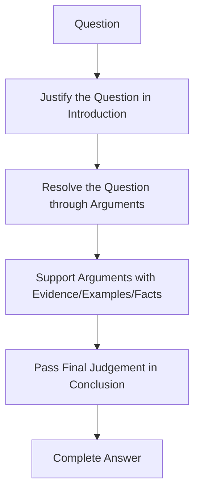

# UPSC GS Paper 1 (2026) — Executive Digest

> **Source:** Extracted faithfully from `docs/# UPSC GS Paper 1 2026.md` (Complete Analysis, Sections 1–28).

---

## Section A — Core Exam Wisdom

# 1. Core Exam Wisdom: How to Think About GS1 Answers

## 1.1 The Real Challenge

- 3 hours, 20 questions.
- 10-mark questions = **150 words**.
- 15-mark questions = **250 words**.
- UPSC allows roughly **5–10% tolerance** on word limit.
- If a known 10-mark question is over-written, time is eaten from remaining questions.
- **Indirect penalty** flows to the rest of the paper.

## 1.2 Practical vs Idealistic Answers

Many institutes upload “magical”, high-fi answer sheets that are not realistically reproducible in the exam room. The useful standard is:

> **A practical answer that a well-prepared candidate can actually write under pressure and still fetch around 7/10 marks.**

## 1.3 Universal 3-Part Answer Architecture

Every answer can be built on three components:

| Component | Function | Normal Share |
|---|---:|---|
| **Introduction** | Justify/interpret the question; show you understand exactly what is asked; give a glimpse of what is coming | 10% of words |
| **Main Body** | Resolve the question through arguments + evidence/examples/facts | 80% of words |
| **Conclusion** | Give a final judgement, not a summary; show intellectual depth | 10% of words |

**Word budget for 150-word answer:**  
- Introduction: **20–30 words**  
- Body: about **120 words**  
- Conclusion: **15–25 words**

**Word budget for 250-word answer:**  
- Introduction: **30–40 words**  
- Body: about **200 words**  
- Conclusion: **25–40 words**

## 1.4 Lawyer-and-Judge Model of Answer Writing

**Principle:**  
- Prelims checks **“Do you know?”**  
- Mains checks **“Can you think?”**  
- Move from **what/when/where** to **how/why**.

## 1.5 A-B Type Question Handling

Most UPSC questions follow **Role of A in B** or **Impact of A on B** pattern.

**Steps:**
1. Identify A and B.
2. Open up A using its own components/examples.
3. Open up B using syllabus dimensions.
4. Link A components to B components.
5. Add examples/data.

**Example:** Satellite technology (A) → Climate-smart agriculture + food security (B). Open satellite tech (GPS, GIS, remote sensing, specific satellites) and food security (availability, access, stability, crop, soil, irrigation).

## 1.6 Data Usage Under Pressure

Exact data often not recallable in exam.  
**Use report names and directional trends instead:**
- “Economic Survey indicates TFR below 1.7 in southern states.”
- “NCRB data reflects rising crime against elderly.”
- “NITI Aayog projects 2.35 crore gig workers by 2030.”

If exact figure not recallable, write **“disproportionately low”**, **“rapidly rising”**, **“almost double”**.

## 1.7 Directive Analysis

| Directive | Meaning | Approach |
|---|---|---|
| **Comment** | Take a stand and support | Accept/partially accept, give evidence |
| **Examine** | Investigate both sides | Show strengths and weaknesses |
| **Evaluate** | Assess value/impact | Positive and negative, judgement |
| **Analyse** | Break into parts | Parts + examples + verdict |
| **Elucidate** | Unfold layers | Explain meaning, dimensions |
| **Substantiate** | Prove with evidence/examples | Give concrete examples, data |

## 1.8 Marks Target Calculation

- If in 15-mark answers you score about **6 marks each**.
- If in 10-mark answers you score about **6 marks each**.
- In 20 questions, approximate total = **120 marks**.
- This is a strong GS1 score and enough to keep selection hopes alive.

---

## Section B — Per-Question Table (20 Questions Evaluated)

| Question # / Topic | Question Text | PYQ Theme Linkage | Answer Skeleton (Headings Only) |
|---|---|---|---|
| History Q1 / Ashokan Inscriptions and Mauryan History | **“Analyse the significance of Ashokan inscriptions for reconstructing Mauryan history.”** 10 marks, 150 words. | 2012 (Historical sources & scriptural sanctions), 2018 | Intro (Epigraphical Context) → Part 1: Polity/Admin → Part 2: Dhamma/Ideology → Conclusion |
| History Q2 / Gandhian Movements and Mass Mobilisation | **“The significance of Gandhian movements lay in the masses they mobilised. Elucidate.”** 10 marks, 150 words. | 2015 (Significance of Gandhi in freedom struggle), 2019 | Intro (S-T-S Strategy) → Non-Cooperation → Civil Disobedience → Quit India → Conclusion |
| History Q3 / Macaulay’s Minute | **“Discuss the impact of Macaulay’s Minute on colonial administration and education in India.”** 10 marks, 150 words. | 2026 (Education & colonial administrative impact) | Intro (1835 Minute) → Administrative Impact → Educational Impact → Conclusion / Judgement |
| History Q4 / Vijayanagara Architecture | **“Vijayanagara architecture exemplifies the amalgamation of past traditions with contemporary practices. Elucidate with examples.”** 10 marks, 150 words. | 2026 (Temple architecture amalgamation) | Intro (Composite Style) → Chola/Chalukya Elements → Islamic Amalgamation → Conclusion |
| History Q5 / Linguistic Reorganisation of Indian States | **“Linguistic reorganisation of Indian states was driven by popular pressure from below. Comment.”** 10 marks, 150 words. | 2026 (Post-independence state formation) | Intro (SRC Context) → Popular Pressure & Movements → Government Response → Conclusion |
| History Q6 / Planned Economy and Regional Imbalances | **“The model of planned economy was adopted in India to address the regional imbalances left behind by colonial rule. Comment.”** 15 marks, 250 words. | 2026 (Post-independence planned economy) | Intro (Colonial Legacies) → Five-Year Plans → Regional Disparities → Conclusion / Judgement |
| Geography Q1 / Fujiwhara Effect | **“What is the Fujiwhara effect? Discuss its impact on the movement and intensity of tropical cyclones.”** 10 marks, 150 words. | 2013, 2014, 2019, 2024 (Tropical cyclone dynamics) | Intro (Definition) → Interaction Mechanism → Impact on Track & Intensity → Conclusion |
| Geography Q2 / Tundra Region | **“Tundra regions are ecologically fragile but economically important.” Examine this statement critically.** 10 marks, 150 words. | 2011 (Tundra biome), 2018 (Arctic resource interest) | Intro (Biome Definition) → Ecological Fragility → Economic Importance → Critical Judgement |
| Geography Q3 / Aeolian Processes and Land Degradation | **“Discuss the role of aeolian processes in desertification and land degradation.”** 10 marks, 150 words. | 2020 (Desertification processes & boundaries) | Intro (Aeolian Mechanics) → Deflation/Abrasion/Dune Migration → Anthropogenic Drivers → Solutions |
| Geography Q4 / South Asia Water Resources | **“Water resources are both an asset and a source of conflict in South Asia.” Examine with examples.** 10 marks, 150 words. | 2015 (Freshwater assets), 2016 (Indus Water Treaty) | Intro (Hydro-politics) → Asset Dimension → Conflict Dimension → Hydro-diplomacy Conclusion |
| Geography Q5 / Loo, Chinook and Foehn Winds | **“Compare the Loo, Chinook and Foehn winds with respect to their regions of prevalence, nature and climatic impact.”** 15 marks, 250 words. | 2026 (Local winds comparative climatology) | Intro (Local Wind Types) → Prevalence & Physical Nature → Climatic & Agro Impacts → Conclusion |
| Geography Q6 / Satellite-Based Tech in Climate-Smart Agriculture | **“Analyse the role of satellite-based technologies in achieving climate-smart agriculture and food security.”** 15 marks, 250 words. | 2026 (Remote sensing applications in agriculture) | Intro (CSA Concept) → Satellite Roles (GIS/RS/GPS) → Food Security Linkage → Conclusion |
| Geography Q7 / Global Trade Shift from Atlantic to Indo-Pacific | **“The centre of global trade is gradually shifting from the Atlantic region to the Indo-Pacific region.” Examine.** 15 marks, 250 words. | 2026 (Global geo-economic trade shifts) | Intro (Global Trade Pivot) → Drivers of Indo-Pacific Shift → Atlantic Resilience → Conclusion |
| Geography Q8 / Human-Induced Land Use Changes | **“Analyse the major drivers of human-induced land use changes in India and their geographical consequences.”** 15 marks, 250 words. | 2026 (Land degradation & anthropogenic drivers) | Intro (Land Use Dynamics) → Major Drivers → Geographical Consequences → Remedial Conclusion |
| Society Q8 / Unity in Diversity Despite Communalism & Regionalism | **“Unity in diversity remains the defining feature of Indian society despite the challenges from communalism and regionalism.” Comment.** 10 marks, 150 words. | 2017, 2020 (Diversity vs divisive forces) | Intro (Constitutional Pluralism) → Communalism Challenges → Regionalism Dynamics → Synthesis Conclusion |
| Society Q9 / Understanding Disability and Inclusive Policy Need | **“How do you understand disability? Substantiate the need for inclusive policy framework in India in this regard.”** 10 marks, 150 words. | 2020 (Inclusive development & accessibility) | Intro (Social Model of Disability) → Structural Barriers → Inclusive Framework Pillars → Conclusion |
| Society Q10 / Digital Technology and Social Empowerment | **“Do you think digital technology promotes social empowerment? Explain with examples.”** 10 marks, 150 words. | 2020, 2023 (Digital inclusion & empowerment) | Intro (Digital Public Infra) → Empowerment Dimensions → Digital Divide Constraints → Conclusion |
| Society Q18 / Is Caste Disappearing in Urban India? | **“Is caste disappearing in urban India? Illustrate your answer with examples.”** 15 marks, 250 words. | 2020 (Caste mutations in modern economy) | Intro (Urban Anonymity) → Ritual Attenuation → Structural Persistence → Dialectical Judgement |
| Society Q19 / Demographic Transition Challenges | **“Critically examine the challenges of demographic transition in contemporary India.”** 15 marks, 250 words. | 2013, 2021 (Demographic dividend vs ageing) | Intro (TFR Trends & Window) → Regional Divergence → Ageing & Skilling Bottlenecks → Policy Conclusion |
| Society Q20 / Impact of Globalisation on Indian Youth | **“Evaluate the impact of globalisation on Indian youth with reference to social, political, economic and cultural spheres.”** 15 marks, 250 words. | 2016, 2019 (Globalisation socio-cultural impacts) | Intro (Youth Cohort Context) → Economic/Social Impacts → Cultural/Political Shifts → Balanced Judgement |

---

## Section C — Recurring PYQ Theme Tracker

# 26. Recurring PYQ Theme Tracker

| Discipline | Theme | Years |
|---|---:|---|
| Ancient History | Reconstruction from historical records/evidence | 2012, 2018, 2026 |
| Modern History | Gandhi and mass mobilisation | 2015, 2019, 2026 |
| Modern History | Education and colonial impact | 2026 (Macaulay) |
| Art/Culture | Temple architecture and amalgamation | 2026 (Vijayanagara) |
| Post-Independence | Linguistic reorganisation | 2026 |
| Post-Independence | Planned economy and regional balance | 2026 |
| Geography | Tropical cyclones | 2013, 2014, 2019, 2024, 2026 |
| Geography | Arctic/Tundra | 2011, 2018, 2026 |
| Geography | Desertification/land degradation | 2020, 2026 |
| Geography | Water resources | 2015, 2016, 2023, 2026 |
| Society | Unity in diversity/regionalism | 2017, 2020, 2026 |
| Society | Disability/inclusive growth | 2020, 2026 |
| Society | Digital empowerment | 2020, 2023, 2026 |
| Society | Caste in contemporary India | 2020, 2026 |
| Society | Demographic transition | 2013, 2021, 2026 |
| Society | Globalisation and youth | 2016, 2019, 2026 |

---

## Section D — Summary Table of All Questions

# 27. Summary Table of All Questions

| Q.No. | Subject | Topic | Marks | Core Thesis |
|---|---|---|---|---|
| History Q1 | Ancient | Ashokan inscriptions | 10 | Inscriptions provide direct evidence for Mauryan polity, ideology, geography |
| History Q2 | Modern | Gandhian movements | 10 | Significance lay in mass mobilisation |
| History Q3 | Modern | Macaulay’s Minute | 10 | Contradictory impact on administration and education |
| History Q4 | Art/Culture | Vijayanagara architecture | 10 | Amalgamation of past and contemporary |
| History Q5 | Post-Ind | Linguistic reorganisation | 10 | Driven by popular pressure from below |
| History Q6 | Post-Ind | Planned economy | 15 | Adopted to correct colonial regional imbalances |
| Geography Q1 | Physical | Fujiwhara effect | 10 | Cyclone interaction impacts movement/intensity |
| Geography Q2 | Physical | Tundra region | 10 | Fragile ecology, economic importance linked critically |
| Geography Q3 | Physical | Aeolian processes | 10 | Wind processes drive desertification/land degradation |
| Geography Q4 | Human/Eco | South Asia water resources | 10 | Asset and conflict; need river diplomacy |
| Geography Q5 | Physical | Loo, Chinook, Foehn | 15 | Compare prevalence, nature, climatic impact |
| Geography Q6 | Indian | Satellite tech & climate-smart agri | 15 | Satellite tech enables precision and resilience |
| Geography Q7 | Human/Eco | Trade shift Atlantic → Indo-Pacific | 15 | Shift real but partial; Atlantic still strong |
| Geography Q8 | Indian | Human-induced land use change | 15 | Drivers and geographical consequences linked |
| Society Q8 | Society | Unity in diversity | 10 | Constitutional accommodation ensures unity |
| Society Q9 | Society | Disability & inclusive policy | 10 | Social model; need structural accessibility |
| Society Q10 | Society | Digital tech & empowerment | 10 | Equaliser but digital divide must be bridged |
| Society Q18 | Society | Caste in urban India | 15 | Ritual decline, structural mutation |
| Society Q19 | Society | Demographic transition challenges | 15 | Time-bound window; risk of demographic disaster |
| Society Q20 | Society | Globalisation impact on youth | 15 | Double-edged across four spheres |

---

## Section E — Consolidated Preparation Strategy

# 25. Consolidated Preparation Strategy

## 25.1 For History

| Principle | Action |
|---|---|
| Use PYQs to map sources | Class 12 Themes, Bipan Chandra for Modern |
| Post-Independence is not optional | Prepare it in depth |
| World History may be omitted but not guaranteed | Do not ignore syllabus |
| Theme repetition | Build theme-based notes |
| Answer writing | Practise 10- and 15-markers under pressure |

## 25.2 For Geography

| Principle | Action |
|---|---|
| Combine Geography + Environment + Disaster | Cyclone, desertification, tundra, water conflicts |
| Don’t over-trust topic weight | Climatology can dominate any year |
| Learn process-based answers | Deflation, saltation, abrasion, albedo, upwelling |
| Use maps/diagrams in answers | But only if they save time |
| Develop exam-ready examples | Seroja-Odette, Thar, Sahel, Aravalli, Northern Sea Route |

## 25.3 For Society

| Source | Use |
|---|---|
| **NCERT Class 12: Understanding Indian Society** | Chapters on diversity, exclusion, social institutions, demographic structure |
| **NCERT Class 12: Social Change and Development in India** | Mass media, globalisation, cultural change |
| **Indian Express Explained** | Multidimensional current examples; use daily for answer fodder |
| **The Hindu** | Good for news, but Indian Express better for analytical angles |

## 25.4 Universal Answer Skills

1. **Justify the question** in introduction.
2. **Resolve the question** through arguments.
3. **Support arguments** with evidence, examples, facts.
4. **Pass final judgement** in conclusion.
5. **Allocate marks and space** before writing.
6. **Move from “what” to “how/why”**.
7. **Use practical vocabulary** from standard books, not casual language.
8. **Open up A, open up B, link with examples.**
9. **Use syllabus as a scanning list.**
10. **Keep word limit; save time for remaining questions.**

