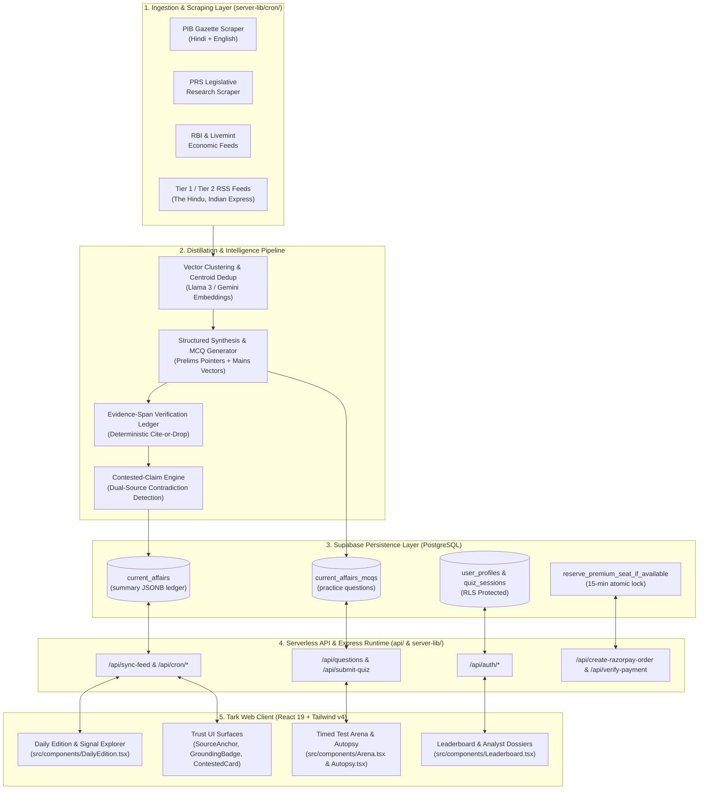

<div align="center">

# Tark | तर्क
### Analytical Test Arena & Daily Current Affairs Intelligence Engine

*A sterile, low-cortisol, minimalist testing arena and automated policy intelligence engine engineered for UPSC Civil Services and State PSC aspirants.*

[](https://react.dev/)
[](https://www.typescriptlang.org/)
[](https://tailwindcss.com/)
[](https://supabase.com/)
[](https://expressjs.com/)
[](https://vitejs.dev/)
[](https://vercel.com/)
[](LICENSE)

---

</div>

## 📑 Table of Contents

- [Architectural Philosophy](#-architectural-philosophy)
- [System Architecture Diagram](#-system-architecture-diagram)
- [Core Subsystems & Feature Highlights](#-core-subsystems--feature-highlights)
  - [1. Daily Intelligence & Executive Edition](#1-daily-intelligence--executive-edition)
  - [2. Trust UI & Deterministic Verification Ledger](#2-trust-ui--deterministic-verification-ledger)
  - [3. Analytical Test Arena & Autopsy Engine](#3-analytical-test-arena--autopsy-engine)
  - [4. Contested-Claim Engine](#4-contested-claim-engine)
  - [5. Public Profiles & Global Leaderboard](#5-public-profiles--global-leaderboard)
  - [6. High-Concurrency Monetization Engine](#6-high-concurrency-monetization-engine)
- [Subsystem Wiring Matrix](#-subsystem-wiring-matrix)
- [ICM Architecture & Knowledge Graph](#-icm-architecture--knowledge-graph)
- [Getting Started & Local Development](#-getting-started--local-development)
  - [Prerequisites](#prerequisites)
  - [Environment Configuration](#environment-configuration)
  - [Run Dev Server](#run-dev-server)
  - [Build & Typecheck](#build--typecheck)
- [Operational Invariants & Security](#-operational-invariants--security)
- [Repository Structure](#-repository-structure)

---

## 🏛 Architectural Philosophy

Competitive examinations like the UPSC Civil Services require deep conceptual retention, high-precision recall under extreme time pressure, and factual veracity across hundreds of government policies and economic reports.

**Tark 1.0** is built on three core design tenets:
1. **Low-Cortisol, Sterile Interface**: High-contrast, typography-first, distraction-free aesthetic with zero ads, clickbait, or sensory overload.
2. **Zero-Cost Anti-Hallucination**: Deterministic sentence-level evidence anchoring (`verify.ts`) ensuring every factual claim is anchored directly in primary government gazettes (PIB, PRS, RBI, Supreme Court).
3. **Immediate Diagnostic Feedback**: High-stakes timed test simulations accompanied by deep question-level autopsy analysis, subject radar diagnostics, and AI-driven conceptual explanations.

---

## 🗺 System Architecture Diagram



---

## ⚡ Core Subsystems & Feature Highlights

### 1. Daily Intelligence & Executive Edition
- **Finite, Significance-Ranked Feed**: Delivers a curated 5–10 brief executive daily edition scored across governance impact, constitutional relevance, and economic magnitude.
- **Syllabus Tagging**: Structured categorization conforming directly to UPSC GS Paper 1, 2, 3, 4, and Optional subjects.
- **Prelims & Mains Vectors**: Every brief features a concrete Prelims Fact pointer and an analytical Mains Perspective statement.
- **Gazette Archive & Signal Explorer**: Deep search and ministry/source filtering across historical gazette dispatches.

### 2. Trust UI & Deterministic Verification Ledger
- **Evidence-Span Ledger (`verify.ts`)**: Sentence-segments bodies into stable span IDs (`s0, s1, ...`). Synthesized bullets must cite valid spans and contain verbatim numeric and factual tokens. Bullets failing verification are deterministically dropped.
- **`GroundingBadge`**: Real-time percentage indicator (`100% Grounded`) displaying factual provenance.
- **`SourceAnchor`**: Interactive popover anchored next to verified bullet points. Clicking or hovering reveals:
  - Grounded source entity (e.g. *Grounded in PRS Legislative Research*)
  - Cited evidence span IDs (`s2, s3`)
  - Verbatim excerpt from the primary source document
  - Extracted Facts Ledger (`7.6`, `2021`, `8.6`, `2022`)
  - Direct hyperlink to the original government gazette
- **Full Brief Dossier Modal**: Comprehensive slide-over dossier with full synthesis, evidence provenance, and reading time metrics.

### 3. Analytical Test Arena & Autopsy Engine
- **Timed High-Stakes Simulations**: Configurable question limits, real-time timer countdowns, and UPSC standard negative marking (+2.0 / -0.66).
- **Server-Side Answer Validation**: Anti-cheat scoring architecture executed securely on the backend via [`server-lib/submit-quiz.ts`](file:///c:/Users/bentn/OneDrive/Desktop/SKU/server-lib/submit-quiz.ts).
- **Autopsy Diagnostics (`Autopsy.tsx`)**:
  - Instant percentile ranking calculation relative to all historical platform attempts.
  - Question-by-question post-mortem breakdown with correct answer rationale.
  - Subject-level accuracy radar charts and time-per-question velocity analysis.
  - AI-assisted conceptual insights on incorrect and unattempted vectors.

### 4. Contested-Claim Engine
- **Contradiction Detection (`contested.ts`)**: Extracts structured factual quads `(entity, metric, value, unit, period)` across multi-source clusters.
- **Temporal & Source Differentiation**: Distinguishes true contemporary disputes between independent high-authority institutions from natural sequential revisions.
- **`ContestedCard`**: Dual-column analytical comparison component highlighting disputed figures (e.g., PRS Discom Deficit vs Ministry of Power Annual Report) with actionable UPSC examination strategies.

### 5. Public Profiles & Global Leaderboard
- **Analyst Dossiers (`PublicProfile.tsx`)**: Shareable candidate profiles showcasing Vanguard badges, Trophy counts, Contender points, test history, and subject masteries.
- **Global & Tiered Leaderboards**: Daily and all-time leaderboard rankings with real-time streak calculations and automated reset workers.

### 6. High-Concurrency Monetization Engine
- **Founders Club & Pro Memberships**: Integrated with Razorpay for automated order creation, webhook verification, and instant membership upgrades.
- **15-Minute Seat Locks**: Implements the `reserve_premium_seat_if_available` transactional PostgreSQL RPC to prevent race conditions and oversubscription during limited seat drops.

---

## 📊 Subsystem Wiring Matrix

| Feature / Subsystem | Frontend UI Components | Backend API Endpoints | Supabase Database Schema |
|---|---|---|---|
| **Auth & Profiles** | [`Login.tsx`](file:///c:/Users/bentn/OneDrive/Desktop/SKU/src/components/Login.tsx), [`Profile.tsx`](file:///c:/Users/bentn/OneDrive/Desktop/SKU/src/components/Profile.tsx), [`PasswordReset.tsx`](file:///c:/Users/bentn/OneDrive/Desktop/SKU/src/components/PasswordReset.tsx) | `POST /api/auth/register`<br/>`GET /api/user-limits` | `auth.users`<br/>`public.user_profiles`<br/>`public.saved_articles` |
| **Timed Test Arena** | [`Arena.tsx`](file:///c:/Users/bentn/OneDrive/Desktop/SKU/src/components/Arena.tsx), [`InfoTooltip.tsx`](file:///c:/Users/bentn/OneDrive/Desktop/SKU/src/components/InfoTooltip.tsx) | `GET /api/questions`<br/>`POST /api/submit-quiz`<br/>`POST /api/explanation` | `public.static_questions`<br/>`public.quiz_sessions`<br/>`public.question_attempts` |
| **Autopsy Diagnostics** | [`Autopsy.tsx`](file:///c:/Users/bentn/OneDrive/Desktop/SKU/src/components/Autopsy.tsx) | `POST /api/insights`<br/>`POST /api/bookmark` | `public.saved_insights`<br/>`public.question_attempts` |
| **Daily Intelligence & Trust UI** | [`DailyEdition.tsx`](file:///c:/Users/bentn/OneDrive/Desktop/SKU/src/components/DailyEdition.tsx), [`CurrentAffairs.tsx`](file:///c:/Users/bentn/OneDrive/Desktop/SKU/src/components/CurrentAffairs.tsx), [`TrustUI.tsx`](file:///c:/Users/bentn/OneDrive/Desktop/SKU/src/components/TrustUI.tsx) | `POST /api/sync-feed`<br/>`POST /api/cron/scrape`<br/>`POST /api/cron/newsdata` | `public.current_affairs`<br/>`public.current_affairs_mcqs`<br/>`public.pib_digests` |
| **Leaderboard & Rankings** | [`Leaderboard.tsx`](file:///c:/Users/bentn/OneDrive/Desktop/SKU/src/components/Leaderboard.tsx), [`PublicProfile.tsx`](file:///c:/Users/bentn/OneDrive/Desktop/SKU/src/components/PublicProfile.tsx) | `POST /api/cron/reset-leaderboard` | `public.public_leaderboard`<br/>`public.user_profiles` |
| **Founders Club & Razorpay** | [`Profile.tsx`](file:///c:/Users/bentn/OneDrive/Desktop/SKU/src/components/Profile.tsx) (Membership Modal) | `POST /api/create-razorpay-order`<br/>`POST /api/verify-payment` | `public.pending_orders`<br/>RPC `reserve_premium_seat_if_available`<br/>RPC `upgrade_to_premium` |

---

## 🧠 ICM Architecture & Knowledge Graph

This repository is organized following the **Interpretable Context Methodology (ICM)** to enable autonomous agents and human developers to audit edit impact with complete precision:

```
SKU/
├── .agents/                 # Custom Agent Skills & Rules
├── .obsidian/               # Obsidian Graph View & Canvas Configuration
├── api/                     # Vercel Serverless Function Endpoints
│   ├── auth/                # Registration & Authentication handlers
│   ├── cron/                # Scheduled scrapers, reset workers, and newsdata sync
│   └── tsconfig.json        # Strict serverless TypeScript config
├── docs/                    # Architectural Manuals & Handoff Specs
│   ├── handoffs/            # Subsystem handoff specifications
│   ├── current-affairs.md   # Current affairs ingestion technical manual
│   └── subsystem-wiring.md  # Forensic frontend-backend-database wiring map
├── map/                     # ICM System Map
│   ├── objects/             # Verified system object cards
│   ├── processes/           # End-to-end workflow definitions
│   └── change-matrix.md     # Cross-component impact analysis
├── server-lib/              # Backend Core Libraries & Business Logic
│   ├── cron/ingest/         # Ingestion, clustering, verify, and contested engines
│   ├── auth/                # Supabase auth handlers
│   └── submit-quiz.ts       # Server-side scoring engine
├── src/                     # React 19 Frontend Application
│   ├── components/          # UI Components (Arena, Autopsy, DailyEdition, TrustUI)
│   ├── lib/                 # Supabase client & utility helpers
│   ├── App.tsx              # Root router & layout group
│   └── main.tsx             # Application entrypoint
├── supabase/                # PostgreSQL Migrations & RPC Definitions
└── scripts/                 # Ingestion test harnesses, dry-runs, and corpora tools
```

*To explore the visual knowledge graph, open this repository as an Obsidian vault and launch [`Vault Map.md`](file:///c:/Users/bentn/OneDrive/Desktop/SKU/Vault%20Map.md).*

---

## 🚀 Getting Started & Local Development

### Prerequisites
- **Node.js**: `v20.x` or `v22.x`
- **Package Manager**: `npm`
- **Database**: Supabase Project with PostgreSQL 15+

### Environment Configuration
Create a `.env` file in the project root:

```env
# Supabase Configuration
SUPABASE_URL=https://your-project.supabase.co
SUPABASE_SERVICE_ROLE_KEY=your-supabase-service-role-key
VITE_SUPABASE_URL=https://your-project.supabase.co
VITE_SUPABASE_ANON_KEY=your-supabase-anon-key

# AI Model Endpoints (Gemini / Groq / HuggingFace)
GEMINI_API_KEY=your-gemini-api-key
AI_ENDPOINT_URL=https://your-hf-endpoint.space/api/chat_fn

# Cron & Internal Security
INTERNAL_WORKER_SECRET=your-internal-worker-secret
CRON_SECRET=your-cron-secret

# Monetization (Razorpay)
VITE_RAZORPAY_KEY_ID=rzp_test_your_key_id
RAZORPAY_KEY_ID=rzp_test_your_key_id
RAZORPAY_KEY_SECRET=your-razorpay-key-secret
```

### Run Dev Server
```bash
# Start combined Express API server + Vite client (port 3000)
npm run dev
```

### Build & Typecheck
```bash
# Run strict TypeScript validation across Web and API targets
npm run lint

# Build production Vite bundle and esbuild Node backend
npm run build

# Start production server
npm run start
```

---

## 🔒 Operational Invariants & Security

1. **Authentication**: All protected client requests must communicate through `fetchWithAuth()` with a valid Bearer JWT.
2. **Deterministic Evaluation**: Quiz scoring and answers are validated strictly server-side in [`server-lib/submit-quiz.ts`](file:///c:/Users/bentn/OneDrive/Desktop/SKU/server-lib/submit-quiz.ts) to guarantee leaderboard integrity.
3. **Seat Concurrency**: Monetization flows strictly utilize transactional locks (`reserve_premium_seat_if_available`) with a 15-minute expiry timeout.
4. **Anti-Hallucination Gate**: Synthesized current affairs must pass cite-or-drop validation before being stamped with verified evidence spans.
5. **Repo Hygiene**: Secrets, `.env` files, agent scratchpads, and production service role credentials must never be committed to source control.

---

<div align="center">

**Built for Serious Aspirants • Tark Intelligence Systems 1.0**

</div>
