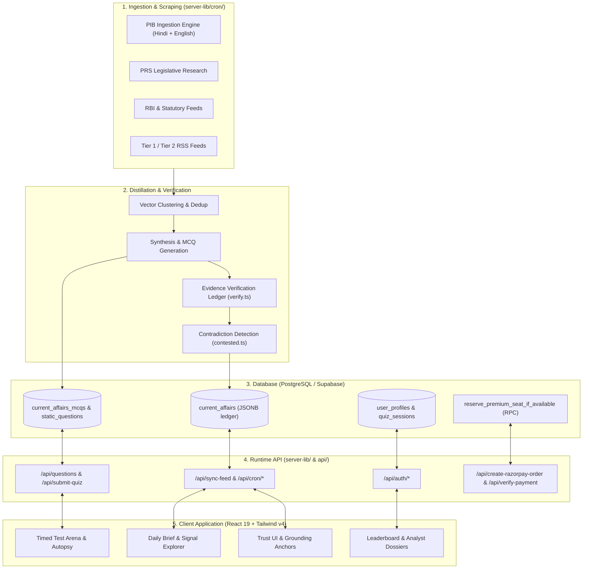

# Tark (तर्क)

> Analytical test arena and policy intelligence engine for competitive examinations.

Tark is a full-stack web application designed for high-precision UPSC Civil Services and State PSC preparation. It combines a timed, server-graded testing arena with an automated daily current affairs distillation pipeline that anchors factual claims in primary government and statutory sources.

---

## System Architecture



---

## Core Capabilities

### 1. Timed Test Arena & Diagnostic Autopsy
- **Strict Server-Side Scoring**: Questions, options, and answers are evaluated on the backend (`server-lib/submit-quiz.ts`). Correct options are never sent to the client during initial question fetch, preventing answer-key exposure.
- **On-Lock Answer Reveal**: Explanations and correct options are revealed individually upon answer lock via `/api/explanation`.
- **Diagnostic Autopsy**: Calculates real-time percentile rankings, time-per-question velocity, and subject-level accuracy breakdowns with UPSC negative marking (+2.0 / -0.66).

### 2. Multi-Source Question Bank & Daily MCQs
- **25-Year PYQ Archive**: Searchable database of authentic UPSC CSE and State PSC prelims questions categorized by syllabus pillar (History, Polity, Economy, Geography, Environment, Science & Tech).
- **Daily Current Affairs MCQs**: Automated question generation from daily policy briefs, directly runnable inside the timed Arena with full leaderboard eligibility.

### 3. Policy Intelligence & Trust UI
- **Evidence-Span Anchoring (`verify.ts`)**: Distilled news summaries are segmented into stable sentence spans. Claims must cite valid spans and pass deterministic token-matching checks or get dropped before publishing.
- **Source Anchors**: Interactive evidence popovers showing exact primary source quotes, cited span IDs, and direct government links.
- **Contested-Claim Engine (`contested.ts`)**: Identifies diverging figures between statutory bodies (e.g., discrepancies between ministry press releases and audit reports).

### 4. Concurrency & Monetization
- **15-Minute Seat Locks**: Implements `reserve_premium_seat_if_available` transactional PostgreSQL RPC to prevent race conditions and oversubscription.
- **Razorpay Integration**: Server-verified order creation, webhook verification, and quota upgrades.

---

## Technology Stack

| Layer | Technologies |
|---|---|
| **Frontend** | React 19, TypeScript 5.8, Tailwind CSS v4, Motion, Lucide Icons, Vite 6 |
| **Backend Runtime** | Node.js, Express 4.21, Vercel Serverless Functions, esbuild |
| **Database & Auth** | Supabase (PostgreSQL 15+), Row Level Security (RLS), Stored Procedures |
| **Testing & Tooling** | Node test runner (`tsx --test`), TypeScript typechecking (`tsc`) |

---

## Directory Structure

```
├── api/                     # Vercel serverless function entry points
│   ├── auth/                # Authentication endpoints
│   └── cron/                # Scheduled background sync and scrapers
├── docs/                    # Technical specifications and architectural docs
├── map/                     # ICM System Map (objects, processes, change matrix)
├── server-lib/              # Backend business logic and database handlers
│   ├── analytics/           # PYQ intelligence and trend analyzers
│   ├── auth/                # Registration and session validation
│   ├── cron/ingest/         # Ingestion, clustering, verification, and MCQ pipelines
│   ├── explanation.ts       # Secure on-lock answer reveal endpoint
│   ├── questions.ts         # Question delivery endpoint
│   └── submit-quiz.ts       # Authoritative server-side quiz grading engine
├── src/                     # React frontend source
│   ├── components/          # Arena, Autopsy, DailyEdition, TrustUI, Leaderboard
│   ├── lib/                 # API client helpers, Supabase client, navigation
│   ├── types.ts             # Shared frontend type definitions
│   └── App.tsx              # Main application shell
├── supabase/                # PostgreSQL schema migrations and stored procedures
└── scripts/                 # Ingestion test harnesses, corpora scripts, and migrations
```

---

## Getting Started

### Prerequisites
- **Node.js**: `v20.x` or `v22.x`
- **npm**: `v10+`
- **Supabase Project**: With PostgreSQL 15+ and schema migrations applied

### Environment Setup

Create a `.env` file in the root directory:

```env
# Supabase Configuration
SUPABASE_URL=https://your-project.supabase.co
SUPABASE_SERVICE_ROLE_KEY=your-service-role-key
VITE_SUPABASE_URL=https://your-project.supabase.co
VITE_SUPABASE_ANON_KEY=your-anon-key

# AI Model Integration (Gemini / Groq / HuggingFace)
GEMINI_API_KEY=your-gemini-api-key
AI_ENDPOINT_URL=https://your-endpoint.com/api/chat_fn

# Cron & Internal Security
INTERNAL_WORKER_SECRET=your-internal-worker-secret
CRON_SECRET=your-cron-secret

# Payments (Razorpay)
VITE_RAZORPAY_KEY_ID=rzp_test_your_key_id
RAZORPAY_KEY_ID=rzp_test_your_key_id
RAZORPAY_KEY_SECRET=your-razorpay-key-secret
```

### Commands

```bash
# Start local development server (Express API on 3000 + Vite on 5173)
npm run dev

# Run TypeScript typechecks across client and API
npm run lint:web
npm run lint:api

# Run test suite
npm test

# Build production bundle (Vite client + esbuild server)
npm run build

# Start production server
npm start
```

---

## Security & Operational Invariants

1. **Client Isolation**: Client requests to protected endpoints require authentication through `fetchWithAuth()` using a Bearer token.
2. **Server-Side Grading**: Answers are never trusted from client submissions. Correctness is evaluated strictly against database records in `server-lib/submit-quiz.ts`.
3. **No Bundle Leaks**: Question endpoints exclude `correct_option` and `correct_index` from bulk payloads. Answers are fetched on-demand per question lock.
4. **Transactional Monetization**: Seat reservations enforce transactional PostgreSQL locks with 15-minute expiration windows.
5. **Repo Hygiene**: Secrets, credentials, service role keys, and internal agent scratchpads are excluded from version control.

---

## License

MIT
