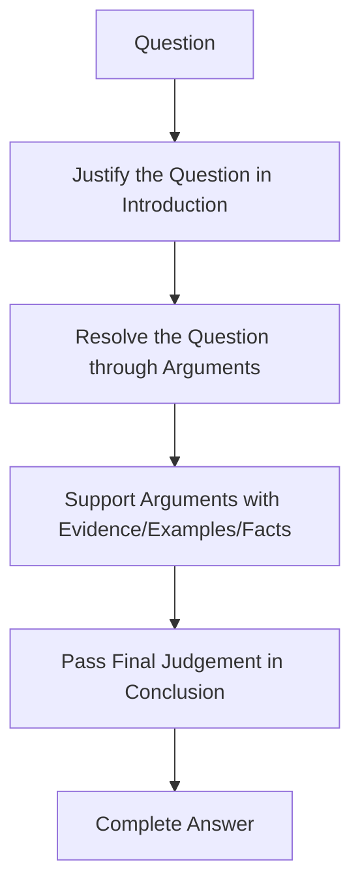

# UPSC GS Paper 1 2026 – History & Geography Analysis  
## Annotated Answer-Building Notes from Detailed Faculty Discussion

> **Prepared from:** Study IQ GS1 2026 discussion transcript.  
> **Scope:** Ancient, Modern and Post-Independence History questions + Geography questions.  
> **Approach:** Promotional/repetitive/technical fluff removed; all conceptual content, answer frameworks, model points, examples, PYQ linkages and exam strategies retained.

---

## 1. Core Exam Wisdom: How to Think About GS1 Answers

### 1.1 The Real Challenge

- 3 hours, 20 questions.
- 10-mark questions = **150 words**.
- 15-mark questions = **250 words**.
- UPSC allows roughly **5–10% tolerance** on word limit.
- If a known 10-mark question is over-written, time is eaten from remaining questions.
- **Indirect penalty** flows to the rest of the paper.

### 1.2 Practical vs Idealistic Answers

Many institutes upload “magical”, high-fi answer sheets that are not realistically reproducible in the exam room. The useful standard is:

> **A practical answer that a well-prepared candidate can actually write under pressure and still fetch around 7/10 marks.**

### 1.3 Universal 3-Part Answer Architecture

Every answer can be built on three components:

| Component | Function | Normal Share |
|---|---:|---|
| **Introduction** | Justify/interpret the question; show you understand exactly what is asked; give a glimpse of what is coming | 10% of words |
| **Main Body** | Resolve the question through arguments + evidence/examples/facts | 80% of words |
| **Conclusion** | Give a final judgement, not a summary; show intellectual depth | 10% of words |

**Word budget for 150-word answer:**  
- Introduction: **20–30 words**  
- Body: about **120 words**  
- Conclusion: **15–25 words**

**Word budget for 250-word answer:**  
- Introduction: **30–40 words**  
- Body: about **200 words**  
- Conclusion: **25–40 words**

### 1.4 Lawyer-and-Judge Model of Answer Writing

**Principle:**  
- Prelims checks **“Do you know?”**  
- Mains checks **“Can you think?”**  
- Move from **what/when/where** to **how/why**.

### 1.5 Marks Target Calculation

- If in 15-mark answers you score about **6 marks each**.
- If in 10-mark answers you score about **6 marks each**.
- In 20 questions, approximate total = **120 marks**.
- This is a strong GS1 score and enough to keep selection hopes alive.

---

## 2. History Paper: 2026 Overview

### 2.1 Key Observations

- This year’s History paper was **broadly balanced**.
- **World History questions did not appear.**
- **Two Post-Independence History questions appeared**, which is a clear signal to coaching institutes and aspirants:  
  **Post-Independence India is not a footnote topic.**
- UPSC’s history questions often repeat **themes**, not exact wording.
- Identifying the underlying theme from PYQs is more valuable than predicting exact questions.

### 2.2 History Source Mapping Philosophy

UPSC syllabus does not prescribe standard books. Therefore:

- Use PYQs to identify which standard resources contain sufficient information.
- For Ancient History:
  - New NCERT Class 6–10 content is diluted.
  - Class 11 NCERT (old/ancient) is mostly not core requirement.
  - **Class 12 Themes in Indian History Part 1 — “Kings, Farmers and Towns”** is highly relevant.
  - It focuses on **Epigraphy and Early States**, exactly the source base for Mauryan inscriptions.
- For Modern History:
  - **Class 12 Themes Part 3, Chapter 13** gives insights on Gandhi and National Movement.
  - **Bipan Chandra** chapters on Non-Cooperation Movement and Civil Disobedience Movement are strong sources.
  - The writing style of Bipan Chandra helps build answer-level vocabulary.

---

## 3. History Question 1: Ashokan Inscriptions and Mauryan History

### 3.1 Question

> **“Analyse the significance of Ashokan inscriptions for reconstructing Mauryan history.”**  
> 10 marks, 150 words.

### 3.2 PYQ Theme Linkage

| Year | Question | Common Theme |
|---|---:|---|
| 2012 | Scriptural sanctions of caste system gave it firm structural backing; elaborate based on historical sources. | Reconstructing society from historical sources |
| 2018 | Assess the importance of accounts of Chinese and Arab travellers in reconstructing Indian history. | **Reconstruction of history from historical records/evidence** |
| 2026 | Analyse significance of Ashokan inscriptions for reconstructing Mauryan history. | Same reconstruction theme |

**Lesson:**  
“Reconstruction of history from historical evidence” is a **recurring theme**. Prepare it thematically.

### 3.3 Directive Analysis

**Directive = Analyse**  
- Break the core issue into parts.
- Explain each part.
- Support each part with a suitable example.
- End with a clear analytical verdict.

### 3.4 Four Analytical Parts Identified

| Part | Why Important |
|---|---|
| 1. Geographical extent | Edicts physically map the empire’s vast boundaries. |
| 2. Administrative apparatus | Reveals bureaucracy and provincial governance directly from state records. |
| 3. State ideology | Shows shift from military expansion to moral consolidation (Dhamma). |
| 4. Chronological certainty | Anchors Indian timelines through synchronisms with foreign kings. |

### 3.5 Answer Skeleton

#### Introduction (About 29 Words)

> “Deciphered by James Prinsep, Ashokan inscriptions form the imperial bedrock of Mauryan history. They transcend literary myths, providing direct, unadulterated insight into the empire’s administration, spatial extent and state ideology.”

**Why this works:**  
- Names James Prinsep — shows factual recall.  
- Uses “imperial bedrock” — strong phrase.  
- Indirectly tells examiner: “I know Buddhist texts contain myths, but inscriptions are direct evidence.”  
- Previews the four body parts.

#### Body Heading

> **“Significance in Reconstructing Mauryan History”**

#### Part 1: Geographical Extent

**Point:**  
Physical distribution of edicts accurately maps the empire’s vast boundaries.

**Example:**  
Placements from **Kandahar (North-West)** to **Yerragudi (South)** reveal the empire’s reach.

#### Part 2: Administrative Apparatus

**Point:**  
Inscriptions reveal bureaucratic hierarchy and provincial governance mechanisms directly from the state.

**Examples:**  
- **Rajukas** — officials associated with administration/justice.  
- **Dhamma Mahamattas** — special officers for Dhamma and welfare.

#### Part 3: State Ideology — Dhamma

**Point:**  
Inscriptions document a radical shift from militaristic expansion to moral consolidation and public welfare.

**Evidence:**  
- **Major Rock Edict XIII** details remorse after the Kalinga War.  
- Shift from **Bherighosha** (war drum) to **Dhammaghosha** (sound of Dhamma).

#### Part 4: Chronological Certainty

**Point:**  
Inscriptions anchor Indian historical timelines through synchronisms.

**Evidence:**  
Mentions of contemporary Greek/Hellenistic kings such as **Antiochus** help date Indian history.

#### Conclusion

> “Ultimately, these lithic records transform Ashoka from a merely legendary name into a historically tangible statesman, offering insights into ancient political communication and imperial consolidation.”

**Why this works:**  
- Not a summary.  
- Shows intellectual depth.  
- Avoids casual words like “master class” in formal answer.

### 3.6 Enrichment Option

If answer needs more spatial depth:

- Add **“The empire’s extent is visible in extreme points like Kandahar and Yerragudi.”**
- This can secure around **7/10 marks**.

### 3.7 Key Takeaway

- Analyse = divide into parts.  
- Every part gets an example.  
- Introduction = interpret question.  
- Conclusion = judgment, not repetition.

---

## 4. History Question 2: Gandhian Movements and Mass Mobilisation

### 4.1 Question

> **“The significance of Gandhian movements lay in the masses they mobilised. Elucidate.”**  
> 10 marks, 150 words.

### 4.2 Directive Analysis

**Elucidate** = Unfold the layers of the statement; explain what it really means.

### 4.3 PYQ Theme Linkage

| Year | Question | Theme |
|---|---:|---|
| 2015 | How different would the achievement of Indian independence have been without Mahatma Gandhi? | Gandhi’s movements and mass participation |
| 2019 | Many voices strengthened and enriched nationalist movement during Gandhian phase. Elaborate. | Gandhian movement as mass movement |
| 2026 | Significance of Gandhian movements lay in the masses they mobilised. | Same mass-participation theme |

### 4.4 Three Layers Identified

| Layer | Core Idea |
|---|---|
| 1. Demographic inclusivity | Peasants, women, working class entered movement. |
| 2. Geographical expansion | Struggle reached rural hinterlands. |
| 3. Politico-psychological liberation | Mass participation removed fear of British authority. |

### 4.5 Answer Skeleton

#### Introduction

> “The true significance of Gandhian movements did not lie in immediate political concessions but in successfully transforming an elitist, urban-centric intellectual struggle into a pan-Indian mass revolution.”

**Key idea:**  
This references the **1920 Nagpur Congress session**, where Gandhi ensured membership fees were reduced and Congress stopped being an elite talking shop.

#### Body Heading

> **“True Significance in Mobilising the Masses”**

#### Part 1: Demographic Inclusivity

**Point:**  
Gandhiji integrated previously marginalised sections like peasants, women and the working class, making the national movement genuinely representative.

**Examples:**  
- Women actively **broke salt laws** during Civil Disobedience Movement.  
- **Sarojini Naidu** led the **Dharasana Salt Satyagraha**.  
- First Congress session in a village was held at **Faizpur in 1936** — symbol of rural mass base.

#### Part 2: Geographical Expansion

**Point:**  
Through vernacular communication and localised issues, the struggle breached urban confines and penetrated deep into rural hinterlands.

**Examples:**  
- **Forest Satyagraha** in South India.  
- Tribal participation led by **Rani Gaidinliu** in North-East.  
- **Khan Abdul Ghaffar Khan** in North-West Frontier Province — **Khudai Khidmatgars** and **Pakhtun weekly** spread Gandhian ideas.

#### Part 3: Politico-Psychological Liberation

**Point:**  
Mass mobilisation eradicated deep-seated fear of British authority and instilled permanent political consciousness.

**Evidence:**  
- **Nagpur Resolution** turned Congress from elite talk shop into an organisation of the people.  
- Millions willingly courted arrest.  
- **Jail bharo campaign** and peaceful endurance of state violence reflected psychological liberation.

#### Conclusion

> “By institutionalising mass participation, Gandhi democratised national awakening and ensured that independence, when it arrived, was not merely a transfer of power from the British to an elite, but a structurally earned right of the people.”

**Why this works:**  
- Signals that candidate knows more dimensions.  
- Gives a final judgement.  
- Respects word limit.

### 4.6 Practical Note

- No map or flow chart needed for this answer.  
- Simple, well-structured answer can fetch **6.5–7 marks**.

---

## 5. History Question 3: Macaulay’s Minute

### 5.1 Question

> **“Discuss the impact of Macaulay’s Minute on colonial administration and education in India.”**  
> 10 marks, 150 words.

### 5.2 Key Facts

| Fact | Detail |
|---|---|
| Year | **1835** |
| Author | **Lord Macaulay** |
| Document | **Minute on Education, 2 February 1835** |
| Financial basis | British Parliament had allocated **₹1 lakh** under **Charter Act 1813** for education |
| Macaulay’s position | Judicial expert, major British officer |

### 5.3 Directive Analysis

**Discuss** = Present both positive and negative impacts, then analyse the extent.

### 5.4 Core Impact Matrix

| Dimension | Positive Impact | Negative Impact |
|---|---|---|
| **Colonial Administration** | English-educated Indians became interpreters between British rulers and Indian masses. | English education was imposed on Indians. |
| | Administration was economised — lower-level clerks available at lower salaries. | Vernacular education weakened. |
| | Indians entered civil services — e.g., **Satyendra Nath Tagore**. | Gurukul and pathshala systems suffered. |
| | Educated Indians understood exploitative British policies, leading to **rise of nationalism**. | Created a class alienated from its own roots. |
| **Education** | Western scientific and technical education introduced. | Traditional Indian education declined. |
| | Created a new educated class — “English in taste but Indian in blood and colour.” | Madrasa system affected. |
| | Same class later influenced nationalism. | Led to mental slavery/colonial mindset. |
| | Downward filtration theory — educate few, they will educate masses. | Education remained limited to elites initially. |

### 5.5 Answer Flow

#### Introduction

- Justify why the question matters.
- Macaulay’s Minute of **1835** was a watershed in colonial education and administration.
- It promoted English education and impacted both governance and Indian society.

#### Body Part 1: Impact on Colonial Administration

- Positive:
  - Creation of interpreter class between British and millions of Indians.
  - Economising administration through English-educated clerks.
  - Indians like Satyendra Nath Tagore entering civil services.
  - Rise of modern nationalism once educated Indians understood exploitation.

- Negative:
  - Imposition of English medium.
  - Decline of vernacular administrative/educational structures.
  - Downward filtration theory created only a narrow educated class.

#### Body Part 2: Impact on Education

- Positive:
  - Western science/technical education.
  - Emergence of English-educated class.
  - Later, this class became carriers of nationalism.

- Negative:
  - Traditional gurukul/pathshala and madrasa systems declined.
  - Created mental subordination to colonial worldview.

#### Conclusion

> “Macaulay’s Minute led to several positive and negative implications that went a long way in India, leading both to support to colonialism as well as the rise of nationalism — a deeply contradictory legacy.”

**Add current relevance:**  
The debate continues: shift from **colonial mindset to pure swadeshi mindset** and promotion of Indian institutions.

---

## 6. History Question 4: Vijayanagara Architecture

### 6.1 Question

> **“Vijayanagara architecture exemplifies the amalgamation of past traditions with contemporary practices. Elucidate with examples.”**  
> 10 marks, 150 words.

### 6.2 Context

| Fact | Detail |
|---|---|
| Vijayanagara Empire established | **1336** |
| Continued till | About **1670** |
| Religious orientation | Supported **Brahmanism** |
| Historical position | Sandwiched between **Delhi Sultanate** and **Mughal Empire** |

### 6.3 What “Amalgamation” Means Here

| Type | Source |
|---|---|
| **Past traditions** | Pre-Sultanate South Indian temple architecture — **Pallavas of Kanchi**, **Imperial Cholas of Thanjavur**, **Later Pandyas** |
| **Contemporary practices** | Islamic influences from **Bahmani Sultanate** and other contemporary Islamic kingdoms |

### 6.4 Element Mapping

| Architectural Element | Origin/Influence |
|---|---|
| Long **vimana** | Chola/Pallava tradition |
| **Gopurams** | South Indian temple tradition |
| Shiva/Nandi motifs | Past Hindu temple tradition |
| **Mandapas** | Past tradition, but Vijayanagara made them **Kalyan Mandapas** — large marriage/assembly halls |
| **Arches** in Lotus Mahal | Islamic/Bahmani influence |
| Round/angular structures in Lotus Mahal | Islamic style |
| **Hanging pillars** | Contemporary Islamic influence |
| Supporting brackets / **Yali** motifs | Sultanate/contemporary interaction |

### 6.5 Key Examples

| Example | Location |
|---|---|
| **Hazara Ramaswamy Temple** | Hampi |
| **Virupaksha Temple** | Hampi |
| **Veerabhadra Temple** | Lepakshi region, Anantapur |
| **Lotus Mahal** | Hampi |

### 6.6 Answer Flow

#### Introduction

> “Vijayanagara architecture is a reflection of pre-Sultanate South Indian architecture along with influence of contemporary Islamic culture.”

#### Body

**Argument 1: Past traditions were carried forward.**  
- Large temple complexes at Hampi and Lepakshi.
- Features like vimana, gopuram, Shiva/Nandi derived from Pallavas, Cholas, Pandyas.

**Argument 2: Contemporary practices were incorporated.**  
- Lotus Mahal shows Islamic arches.
- Hanging pillars and brackets show Sultanate/Islamic influence.
- Mandapas evolved into **Kalyan Mandapas** — a contemporary innovation.

#### Conclusion

> “Vijayanagara dynasty, sandwiched between two Islamic empires, carried past traditions and incorporated contemporary culture, making its architecture relevant in nature.”

---

## 7. History Question 5: Linguistic Reorganisation of Indian States

### 7.1 Question

> **“Linguistic reorganisation of Indian states was driven by popular pressure from below. Comment.”**  
> 10 marks, 150 words.

### 7.2 Directive Analysis

**Comment** = Take a stand, then support it with arguments and evidence.

### 7.3 Key Events and Evidence

| Event/Phase | Detail |
|---|---|
| First major demand | Telugu-speaking people in Madras demanded separate state |
| Initial government response | **Dhar Commission** and **JVP Committee** rejected linguistic reorganisation |
| Fear | Multiple languages could lead to balkanisation |
| Popular pressure leader | **Potti Sriramulu** (transcript: “P. Shriram Malo”) |
| Method | Hunger strike for Telugu state |
| Outcome | He died after about 50+ days |
| Government response | Sympathy led to creation of **Andhra** as pure Telugu state |
| Later | **States Reorganisation Commission** formed |
| Act | **States Reorganisation Act, 1956** |
| Further pressure | **Gujarat and Maharashtra** split from Bombay in **1960** |
| Sikh community pressure | Punjab issue; creation of **Haryana** and **Himachal Pradesh** as Hindi-speaking states later |
| Continuous trend | Demands kept coming from below, states kept being reorganised |

### 7.4 Answer Flow

#### Introduction

> “Linguistic reorganisation became a major demand of popular masses from different parts of the country in the post-independence era.”

#### Body

**Point 1:** The demand was first raised from below by Telugu-speaking people in Madras.

**Evidence:**  
- Dhar Commission and JVP Committee rejected linguistic reorganisation.
- Potti Sriramulu’s hunger strike and death forced the creation of Andhra.

**Point 2:** Pressure from below continued after 1956.

**Evidence:**  
- Maharashtra and Gujarat were created in 1960.
- Sikh community demanded separate Punjabi linguistic region.
- Haryana and Himachal Pradesh were carved out of Punjab.

#### Conclusion / Judgement

> “Linguistic reorganisation of states, demanded by people from below, resulted in regional aspirations, regional identity, and also contributed to regionalism in India.”

---

## 8. History Question 6: Planned Economy and Regional Imbalances

### 8.1 Question

> **“The model of planned economy was adopted in India to address the regional imbalances left behind by colonial rule. Comment.”**  
> 15 marks, 250 words.

### 8.2 Colonial Uneven Development

| Aspect | Uneven Impact |
|---|---|
| Focus areas | Port areas — western coast, eastern coast, Madras |
| Main cities | **Calcutta, Bombay, Madras** |
| Interior regions | Neglected |
| Industries | Concentrated in three presidency cities |
| Tribal pockets | Left out — e.g., **Chota Nagpur Plateau**, **Khandesh**, **North-East** |
| Irrigation | Mainly in **North-West Punjab** |
| Agriculture | Cash crops like **indigo** promoted in selected areas only |
| Employment | Only around port/industrial cities |

### 8.3 Post-Independence Context

- Partition increased economic dislocation:
  - Fertile agricultural areas went to Pakistan.
  - Irrigation facilities went to Pakistan.
  - Jute-growing areas went to East Pakistan.
- These factors made planned economy necessary.

### 8.4 Planned Economy Response

| Measure | Example |
|---|---|
| Institution | **Planning Commission** — extra-constitutional body under PM |
| Economic model | **Mixed economy**, state control |
| Infrastructure | **Bhakra Nangal Project**, **Hirakud Project** |
| Planning instrument | **Five Year Plans** |
| Institution building | Educational institutions |
| Tribal integration | **Tribal Panchsheel** |
| Objective | Correct colonial imbalance through planned development |

### 8.5 Answer Flow

#### Introduction

> “Colonial rule was guided by profit maximisation and promoted uneven economic growth, which planned economy sought to rectify after independence.”

#### Body

**Part 1: Colonial imbalance**  
- Port development vs interior neglect.  
- Industry only in Calcutta, Bombay, Madras.  
- Tribal and North-Eastern regions left unintegrated.  
- Irrigation concentrated in North-West Punjab.

**Part 2: Planned economy response**  
- Planning Commission created.  
- Mixed economy, state-led industrialisation.  
- Large dams: Bhakra Nangal, Hirakud.  
- Five Year Plans.  
- Tribal Panchsheel for integration.

#### Conclusion / Judgement

> “Two centuries of colonial rule led to an imbalanced Indian economy, which was rectified to a large extent through the model of planned development.”

---

## 9. Geography Paper: 2026 Overview

### 9.1 Question Distribution

| Section | Number of Questions |
|---|---:|
| Physical Geography | **4** |
| Indian Geography | **2** |
| Human/Economic Geography | **2** |
| **Total** | **8** |

### 9.2 Sectional Themes

| Section | Topics |
|---|---|
| **Physical Geography** | Aeolian processes, Fujiwhara effect, local winds, Tundra region |
| **Indian Geography** | Satellite technology and climate-smart agriculture; land use changes and geographical consequences |
| **Human/Economic Geography** | South Asia water resources; global trade shifting from Atlantic to Indo-Pacific |

### 9.3 Key Observation

- Normally, **Geomorphology** dominates physical geography.
- This year, **Climatology** dominated with **3 questions**:
  1. Fujiwhara effect
  2. Local winds
  3. Tundra region

**Implication:**  
Do not assume topic weight based only on old patterns. Prepare climatology in depth.

---

## 10. Geography Question 1: Fujiwhara Effect

### 10.1 Question

> **“What is the Fujiwhara effect? Discuss its impact on the movement and intensity of tropical cyclones.”**  
> 10 marks, 150 words.

### 10.2 Core Definition

| Term | Detail |
|---|---|
| Scientist | **Sakuhei Fujiwhara**, Japanese scientist |
| Year | **1921** |
| Meaning | Interaction between two cyclonic storms moving in **same direction** |
| Typical behaviour | They rotate around a common point/dance around each other |
| Possible outcome | Smaller one may merge into larger one; can form a larger/super cyclone |

### 10.3 Five-Step Answer Writing Method

**Applied to Fujiwhara:**

| Step | Finding |
|---|---|
| Theme | Fujiwhara effect / tropical cyclones |
| Parts | 2 — definition; impact on movement and intensity |
| Marks allocation | **2.5 for definition**, **7.5 for impact** |
| Space | 25% page for definition; 75% for impact |
| Structure | Intro-Body-Conclusion |

### 10.4 Answer Skeleton

#### Introduction / Definition

- Define Fujiwhara effect.
- Condition: two tropical cyclones moving in same direction in same hemisphere.
- They begin rotating around each other.
- One may dominate, absorb the other, or both may merge.
- Example: **Seroja and Odette** near Australia.

#### Body: Impact on Movement

Movement has two components: **direction and speed**.

| Aspect | Impact |
|---|---|
| **Direction/Path** | Deflection from original track; paths change; circular/orbital motion begins |
| **Speed** | Larger storm influences smaller storm’s speed |
| **Forecasting** | Track becomes highly uncertain; forecasting difficult |
| **Example** | **Prapiroon and Maria (2000)** in Northwest Pacific — Prapiroon deflected, landfall/damage changed |

#### Body: Impact on Intensity

Intensity can **increase or decrease**.

| Scenario | Effect on Intensity |
|---|---|
| Merger/absorption | Larger cyclone strengthens; smaller weakens/disappears |
| Example | **Seroja** absorbed **Odette**, becoming stronger |
| Oceanic feedback/upwelling | Cyclone low pressure pulls cold subsurface water upward, cooling sea surface temperature, reducing intensity |
| Result | Cyclone may weaken over time |

#### Conclusion

- Global warming and climate change are making cyclone interaction more frequent/hazardous.
- Need continuous monitoring using:
  - Earth observation satellites
  - Remote sensing
  - Space technology
- Goal: reduce impact on humans and ecosystems.

### 10.5 PYQ Chain on Cyclones

| Year | Question |
|---|---|
| 2013 | Cyclones and east coast of India |
| 2014 | Why tropical cyclones largely form in South China Sea, Bay of Bengal, Gulf of Mexico |
| 2019 | Colour-coded weather warnings |
| 2024 | Sea surface temperature and cyclone formation |
| 2026 | Fujiwhara effect and impact on movement/intensity |

**Preparation lesson:**  
Study **Geography + Disaster Management + Environment** together. They are not separate subjects.

---

## 11. Geography Question 2: Tundra Region

### 11.1 Question

> **“Tundra regions are ecologically fragile but economically important.” Examine this statement critically.**  
> 10 marks, 150 words.

### 11.2 Definition

- Tundra region is extremely cold region.
- Roughly between **60° and 75° latitude**.
- Mainly in the **Northern Hemisphere** because southern high latitudes have mostly ocean.

### 11.3 Answer Structure

| Section | Purpose |
|---|---|
| Introduction | Define tundra |
| Body Part 1 | Ecologically fragile |
| Body Part 2 | Economically important |
| Critical examination | Link the two; show contradictions/threats |
| Conclusion | Ecosystem-based approach |

### 11.4 Ecologically Fragile Points

| Point | Explanation |
|---|---|
| **Permafrost** | Permanently frozen ground; melting destabilises soils, cracks appear |
| **Carbon release** | Melting ice/glaciers release trapped CO₂, accelerating warming |
| **Climate feedback loop** | Less ice → lower albedo → more absorption → more melting |
| **Arctic amplification** | Chain reaction where warming is amplified in Arctic |
| **Habitat loss** | Polar bear, Arctic fox, reindeer, migratory birds affected |
| **Pathogen threat** | 2016 Siberia anthrax release due melting; 48,000-year-old coronavirus found in ice |

### 11.5 Economically Important Points

| Resource | Example/Detail |
|---|---|
| Minerals | Nickel, cobalt, rare earth elements, palladium |
| Hydrocarbons | Russia’s **Yamal Peninsula** — natural gas |
| Shipping routes | **Northern Sea Route**; Russia using icebreakers |
| Fisheries | Ice melt opens new water areas |
| Tourism | Wildlife/polar tourism rising |

### 11.6 Critical Examination

This is what upgrades the answer:

1. **Economic importance exists because of ecological fragility.**  
   Ice melt exposes minerals, opens routes and increases accessibility.

2. **Economic opportunity does not guarantee sustainable success.**  
   Melting permafrost can release diseases; infrastructure built on permafrost becomes unstable.

3. **Geopolitical greed is dominant.**  
   - Antarctic Treaty (1959) has strict conditions.  
   - Arctic has no such treaty; only **Arctic Council**, which is not legally binding.  
   - Countries focus on resource extraction, not ecosystem protection.

4. **Indigenous communities face habitat loss.**  
   Example: **Inuit communities** of the Arctic.

### 11.7 Conclusion

Use three-part sustainability filter:

> Any resource use must be **economically viable, socially acceptable, environmentally sustainable**.

Recommended approach:

- **Ecosystem-based approach** to development.
- Avoid large ice-breaking machines that fragment ice and accelerate melting.
- Protect indigenous tribes and species.

### 11.8 PYQ Linkage

| Year | Question |
|---|---|
| 2011 Prelims | Tundra biome features |
| 2018 Mains | Why India is taking keen interest in Arctic region |
| 2026 Mains | Tundra fragile but economically important |

---

## 12. Geography Question 3: Aeolian Processes and Land Degradation

### 12.1 Question

> **“Discuss the role of aeolian processes in desertification and land degradation.”**  
> 10 marks, 150 words.

### 12.2 Core Processes

| Process | Mechanism |
|---|---|
| **Deflation** | Wind removes fine sand/soil particles; creates deflation hollows; deposits them elsewhere |
| **Saltation** | Coarser sand particles move by **hopping/jumping** |
| **Abrasion / Sand blasting** | Wind-driven sand particles hit rocks, grind/erode them into finer particles |

### 12.3 Desert Types for Examples

| Desert Type | Character |
|---|---|
| **Hamada** | Rocky desert |
| **Erg** | Sandy desert |

### 12.4 Geographical Examples

| Example | Relevance |
|---|---|
| **Thar Desert** | Common location for deflation and wind erosion |
| **Sahara Desert** | Sand spread; rocky and sandy regions |
| **Sahel region, Africa** | Rapid desertification and land degradation |
| **Taklamakan Desert, China** | Dune migration |
| **Aravalli Range, India** | Blocks Thar desert expansion eastward; if absent, Western MP/UP could face desert formation |
| **Ganga Plain** | Would be impacted if Aravalli barrier weakens |

### 12.5 Anthropogenic Acceleration

Natural aeolian processes become dangerous when humans intensify them:

- **Urbanisation**
- **Industrialisation**
- **Deforestation**
- **Overgrazing**
- **Excessive cultivation**

**Why overgrazing matters:**  
Grass roots are dense and hold soil. When grass is removed, soil becomes loose and wind easily carries it away.

### 12.6 Answer Flow

#### Introduction

- Define aeolian processes as wind-driven erosional and depositional processes.
- Link them to desertification and land degradation.

#### Body

**Point 1: Deflation**  
- Wind removes fine particles.  
- Example: Thar Desert.

**Point 2: Saltation**  
- Larger sand particles move by hopping.  
- Contributes to sand movement and land surface change.

**Point 3: Abrasion / sand blasting**  
- Wind-driven sand particles erode rocks.  
- Example: rocky deserts like Hamada.

**Point 4: Sand encroachment**  
- Sand migrates onto agricultural land.  
- Affects food security.

**Point 5: Dune migration**  
- Example: Taklamakan Desert.

**Point 6: Vegetation loss**  
- Example: Sahel region.

**Point 7: Human acceleration**  
- Deforestation, overgrazing, excessive cultivation.  
- Loose soil = more wind erosion.

#### Conclusion / Solutions

- Controlled grazing.
- Sustainable agricultural practices.
- Check deforestation.
- Green belts around desert regions.
- Trees reduce soil and sand spread.

### 12.7 PYQ Theme

| Year | Question |
|---|---|
| 2020 | “The process of desertification does not have climate boundaries.” Justify with examples. |
| 2026 | Role of aeolian processes in desertification and land degradation |

**Lesson:**  
Themes repeat; question wording changes.

---

## 13. Geography Question 4: South Asia Water Resources

### 13.1 Question

> **“Water resources are both an asset and a source of conflict in South Asia.” Examine with examples.**  
> 10 marks, 150 words.

### 13.2 Theme Analysis

- **Theme:** Water resources in South Asia.
- **Question parts:**  
  1. Water resources as asset.  
  2. Water resources as source of conflict.  
  3. Examine with examples.

### 13.3 Introduction

Use strong data:

- India has about **2.4% of world’s land surface**.
- India has about **4% of world’s freshwater resources**.
- India supports about **17–18% of world population**.
- South Asian rivers: **Ganga, Indus, Brahmaputra** and their tributaries.

> “South Asia’s water resources are critical for billions of people, but their shared nature also makes them a major source of conflict.”

### 13.4 Asset Points

| Asset | Example/Detail |
|---|---|
| Drinking water | Supports billions in India, Pakistan, Bangladesh |
| Agriculture | Indo-Gangetic plains depend on river water |
| Food security | Irrigation from Ganga, Indus, Brahmaputra |
| Hydropower | Himalayan rivers have high hydropower potential |
| Fisheries | Riverine and coastal fisheries |

### 13.5 Conflict Points

| Conflict | Example/Detail |
|---|---|
| India–Pakistan | **Indus Water Treaty**; issue came into news after Pahalgam attack |
| India–Bangladesh | Ganga/Brahmaputra/Teesta water sharing |
| Nepal–India | Hydropower and flood management |
| China–India | Transboundary Brahmaputra issues |
| General | Riparian disputes, dam construction, water diversion |

### 13.6 Conclusion

- Water is both an economic asset and geopolitical flashpoint.
- Need:
  - Bilateral/multilateral cooperation.
  - Data sharing.
  - Integrated river basin management.
  - Respect for riparian rights.

### 13.7 PYQ Linkage

| Year | Question |
|---|---|
| 2015 | Freshwater resources in India |
| 2016 | Indus Water Treaty |
| Later years | Groundwater resources, water stress, interlinking of rivers |
| 2026 | South Asia water resources as asset and source of conflict |

---

## 14. Geography Question 5: Global Trade Shift from Atlantic to Indo-Pacific

### 14.1 Status

This question was mentioned in the paper overview but not discussed in detail in the provided transcript.

### 14.2 Theme

- Global trade is shifting from the **Atlantic** to the **Indo-Pacific**.
- It connects with:
  - Geopolitics
  - Maritime trade routes
  - Indian Ocean importance
  - Supply chains
  - Regional security

### 14.3 Preparation Cue

While not expanded in transcript, similar topics require:

- Historical shift of trade routes.
- Rise of Asia/India-China-ASEAN.
- Indian Ocean choke points: Malacca, Hormuz, Bab el-Mandeb.
- India’s maritime interests.

---

## 15. Consolidated Preparation Strategy

### 15.1 For History

| Principle | Action |
|---|---|
| Use PYQs to map sources | Class 12 Themes, Bipan Chandra for Modern |
| Post-Independence is not optional | Prepare it in depth |
| World History may be omitted but not guaranteed | Do not ignore syllabus |
| Theme repetition | Build theme-based notes |
| Answer writing | Practise 10- and 15-markers under pressure |

### 15.2 For Geography

| Principle | Action |
|---|---|
| Combine Geography + Environment + Disaster | Cyclone, desertification, tundra, water conflicts |
| Don’t over-trust topic weight | Climatology can dominate any year |
| Learn process-based answers | Deflation, saltation, abrasion, albedo, upwelling |
| Use maps/diagrams in answers | But only if they save time |
| Develop exam-ready examples | Seroja-Odette, Thar, Sahel, Aravalli, Northern Sea Route |

### 15.3 Universal Answer Skills

1. **Justify the question** in introduction.
2. **Resolve the question** through arguments.
3. **Support arguments** with evidence, examples, facts.
4. **Pass final judgement** in conclusion.
5. **Allocate marks and space** before writing.
6. **Move from “what” to “how/why”**.
7. **Use practical vocabulary** from standard books, not casual language.

---

## 16. Recurring PYQ Theme Tracker

| Discipline | Theme | Years |
|---|---:|---|
| Ancient History | Reconstruction from historical records/evidence | 2012, 2018, 2026 |
| Modern History | Gandhi and mass mobilisation | 2015, 2019, 2026 |
| Modern History | Education and colonial impact | 2026 (Macaulay) |
| Art/Culture | Temple architecture and amalgamation | 2026 (Vijayanagara) |
| Post-Independence | Linguistic reorganisation | 2026 |
| Post-Independence | Planned economy and regional balance | 2026 |
| Geography | Tropical cyclones | 2013, 2014, 2019, 2024, 2026 |
| Geography | Arctic/Tundra | 2011, 2018, 2026 |
| Geography | Desertification/land degradation | 2020, 2026 |
| Geography | Water resources | 2015, 2016, 2023, 2026 |

---

## 17. Final Takeaway

The core message from the full discussion is:

> **In UPSC Mains, knowledge is only the raw material. The skill is converting knowledge into a structured, example-backed, judgement-based answer within word and time limits.**

- Prepare **themes**, not just facts.
- Read **standard books** for authentic answer vocabulary.
- Practise **answer anatomy**: justify → argue → evidence → judge.
- Maintain **word discipline**.
- Filter out idealistic, non-reproducible “model answers”.
- Use **practical examples** that a candidate can actually recall under pressure.

This is the difference between a coaching-institute model answer and a **real, exam-room answer that scores**.

# UPSC GS Paper 1 2026 – Analysis (Part 2)
## Remaining Geography and All Society Questions – Annotated Answer-Building Notes

> **Continuation from Part 1.**  
> Part 1 covered History Q1–Q6 and Geography Q1–Q3 (Fujiwhara, Tundra, Aeolian processes, and partial Water Resources).  
> This part covers the **remaining Geography questions** (Water Resources conflict dimension, Loo/Chinook/Foehn, Satellite technology, Indo-Pacific shift, Land Use Change) and **all Society questions** (Q8, Q9, Q10, Q18, Q19, Q20).  
> **Approach:** Practical, exam-room focused. All fluff and promotional content removed; only concepts, frameworks, examples, and answer structures retained.

---

## 1. Geography Q4 (Continued): South Asia Water Resources – Conflict Dimension and Solutions

### 1.1 Full Question

> **“Water resources are both an asset and a source of conflict in South Asia.” Examine with examples.**  
> 10 marks, 150 words.

### 1.2 Asset Dimension (Recap from Part 1)

| Asset | Example/Detail |
|---|---|
| Drinking water | Supports billions in India, Pakistan, Bangladesh |
| Agriculture | Indo-Gangetic plains depend on river water |
| Food security | Irrigation from Ganga, Indus, Brahmaputra |
| Hydropower | Himalayan rivers have high hydropower potential |
| Regional cooperation | **Indus Water Treaty (1960)** brokered by World Bank; remained successful till Pahalgam attack |
| Livelihoods | Fisheries, thermal/nuclear power plants need water |

### 1.3 Conflict Dimension – Detailed Points

| Conflict Type | Example/Detail |
|---|---|
| **Upstream–Downstream disputes** | - **China–India:** China building **Medog hydropower project** on Brahmaputra (world’s largest dam); risk of flood release causing devastation in Assam/Arunachal. - **India–Bangladesh:** Teesta river water sharing remains unresolved. |
| **India–Pakistan** | Indus Water Treaty recently suspended after Pahalgam attack; disputes over **Kishanganga** and **Ratle dams** on Jhelum tributary. |
| **India–Sri Lanka** | **Kachchatheevu Island** (given to Sri Lanka in 1974); Tamil Nadu fishermen arrested; maritime boundary conflict. |
| **Gujarat–Pakistan** | **Sir Creek** maritime boundary issue. |
| **General water stress** | Quote: “Third World War will be fought over water, not oil.” |

### 1.4 Answer Structure

#### Introduction

- South Asia’s water resources are critical for billions, but shared nature makes them conflict-prone.
- Note: normally water resources refer to freshwater resources, but in this question both freshwater and marine aspects can be used (marine resources include fisheries, shipping routes).

#### Body Part 1: Water Resources as Asset

- **Drinking water and agriculture:** India has 2.4% of world land, 4% freshwater, 17–18% population.
- **Livelihoods:** Fisheries, thermal power, cement, industries depend on water.
- **Regional cooperation:** Indus Water Treaty (1960) as successful example until recent tensions; India-Nepal/Bhutan hydroelectric cooperation.

#### Body Part 2: Water Resources as Source of Conflict

- **Upstream/downstream:** China’s Medog dam on Brahmaputra; Teesta dispute with Bangladesh.
- **India–Pakistan:** Indus Water Treaty suspension; Kishanganga/Ratle dams.
- **India–Sri Lanka:** Kachchatheevu fishing rights.
- **Sir Creek** between India and Pakistan.
- **Water scarcity and stress:** rising demand, climate change.

#### Conclusion / Solutions

- Water resources are both asset and conflict source.
- Need **river diplomacy**, not weaponisation.
- Prefer **run-of-the-river projects** (small/no reservoir) instead of large dams upstream to reduce fear downstream.
- Promote **multi-track/multi-tier diplomacy**: government (tier 1), NGOs, people-to-people, sports, etc.
- Prevent water wars through cooperation.

### 1.5 Key Vocabulary

- **Water diplomacy**
- **Multi-track diplomacy**
- **Run-of-the-river project**
- **Weaponisation of water**

---

## 2. Geography Q5: Comparison of Loo, Chinook and Foehn Winds

### 2.1 Question

> **“Compare the Loo, Chinook and Foehn winds with respect to their regions of prevalence, nature and climatic impact.”**  
> 15 marks, 250 words.

### 2.2 Three Winds at a Glance

| Wind | Region | Nature | Climatic Impact |
|---|---|---|---|
| **Loo** | North-West India (Punjab, Haryana, Rajasthan, parts of UP) | Hot, dry, fast, pre-monsoon (March–June) | Raises temperature, reduces humidity, damages crops, heat waves |
| **Chinook** | East side of Rocky Mountains (North America – USA, Canada) | Descending, hot, dry, downslope | Melts snow (“snow eater”), raises temperature, runoff, aids grazing |
| **Foehn** | Alps (Europe – Switzerland, Italy) | Descending, hot, dry, downslope | Melts snow, raises temperature, improves visibility, aids grazing |

### 2.3 Mechanisms

#### Loo

- Sun moves north from March to June, heating North India.
- Low pressure forms but no moisture source; dry winds blow from Thar region.
- Pre-monsoon phase; very hot and dry.
- Can cause heat waves and crop damage.

#### Chinook / Foehn

- Both are **downslope winds** on leeward side of mountains.
- Air rises on windward side, cools, drops moisture (clouds/rain).
- Dry air descends on leeward side, compresses, warms adiabatically → hot and dry.
- Chinook on Rockies, Foehn on Alps.
- They melt snow, so called “snow eaters”.
- Favorable for grazing and agriculture in cold regions.

### 2.4 Comparison Table for Answer Body

| Aspect | Loo | Chinook | Foehn |
|---|---|---|---|
| **Prevalence** | North-West India, pre-monsoon | Eastern slopes of Rockies, USA/Canada | Northern slopes of Alps, Switzerland/Italy |
| **Nature** | Hot, dry, fast, horizontal | Descending, downslope, hot, dry | Descending, downslope, hot, dry |
| **Climatic Impact** | Temp ↑, humidity ↓, no cloud, no precipitation, crop damage | Temp ↑, snow melt, runoff, flooding risk, visibility ↑, grass for livestock | Temp ↑, snow melt, runoff, visibility ↑, grazing |

### 2.5 Answer Structure

#### Introduction

- Define each wind briefly; mention they are local winds but Chinook/Foehn are mountain winds; Loo is plain/desert wind.

#### Body: Compare on Three Parameters

**1. Regions of prevalence**
- Loo: North-West India, pre-monsoon.
- Chinook: Rocky Mountains, North America.
- Foehn: Alps, Europe.

**2. Nature**
- Loo: hot, dry, fast, not linked to mountains.
- Chinook/Foehn: descending downslope winds, hot and dry after losing moisture on windward side.

**3. Climatic impact**
- Use climate components: temperature, humidity, cloud cover, precipitation, wind.
- Loo: temperature ↑, humidity ↓, no cloud cover, no precipitation, fast dry wind.
- Chinook/Foehn: temperature ↑, snow melt → runoff, possible floods, clearing snow aids livestock.

#### Conclusion

- Despite different geographies, all three are hot and dry winds that play crucial roles in their regions’ climate and socio-economic conditions.

### 2.6 Additional Notes

- Climate has six components: temperature, humidity, cloud cover, atmospheric pressure, precipitation, wind. Use these to structure “climatic impact” answers.
- Chinook and Foehn are similar; distinguish via location.

---

## 3. Geography Q6: Satellite-Based Technologies in Climate-Smart Agriculture

### 3.1 Question

> **“Analyse the role of satellite-based technologies in achieving climate-smart agriculture and food security.”**  
> 15 marks, 250 words.

### 3.2 Definition of Climate-Smart Agriculture

- Agriculture in sync with climatic conditions of the place.
- Example: dry areas → grow millets (jowar, bajra, ragi) instead of rice; sugarcane unsuitable in water-scarce regions like Vidarbha/Marathwada (rain-shadow of Western Ghats).
- Green Revolution promoted wheat/rice high-yielding varieties, disrupting climate-smart cropping patterns.

### 3.3 Satellite Technologies and Their Roles

| Technology/Satellite | Role |
|---|---|
| **GPS, GIS, Remote Sensing** | Spatial planning, mapping, monitoring |
| **FASAL** (Forecasting Agricultural output using Space, Agrometeorology and Land-based observations) | Crop health, pest stress, yield forecasting |
| **NADAMS** (National Agricultural Drought Assessment and Monitoring System) | Drought risk assessment, rainfall monitoring |
| **INSAT 3D/3DR** | Microclimate, extreme weather forecasting |
| **Meghdoot app** | Localized agro-advisories (sowing, harvesting alerts) |
| **NISAR** (NASA-ISRO Synthetic Aperture Radar) | High-resolution soil moisture data, precision irrigation |
| **RISAT** | Flood mapping, rapid damage assessment |
| **Bhuvan portal** | Land use/land degradation monitoring |

### 3.4 Role in Climate-Smart Agriculture

| Function | Satellite Technology Contribution |
|---|---|
| Crop health monitoring | Identify pest stress, crop stress early |
| Precision irrigation | Soil moisture data → drip irrigation, avoid water waste |
| Microclimate forecasting | Extreme weather alerts, sowing/harvest timing |
| Drought risk assessment | Early warning for dry regions like Marathwada, Bundelkhand |
| Land use planning | Identify suitable crops for climatic zones |

### 3.5 Role in Food Security

- **Pre-harvest yield forecasting** → procurement planning, buffer stock management.
- **Early warning** against food shocks/famine.
- **Crop insurance claim settlement** using satellite data.
- **Trade and price stabilisation** through better supply estimates.

### 3.6 Answer Structure

#### Introduction

- Define climate-smart agriculture; mention satellite technologies as enablers.

#### Body Part 1: Role in Climate-Smart Agriculture

- Crop health monitoring (FASAL).
- Drought assessment (NADAMS).
- Microclimate/weather forecasting (INSAT 3D, Meghdoot).
- Precision irrigation (NISAR).

#### Body Part 2: Role in Food Security

- Pre-harvest yield forecast → buffer stock, procurement.
- Early warning systems.
- Crop insurance.
- Market stability.

#### Conclusion

- Satellite technology is essential for sustainable agriculture; integration with AI/drones can further enhance.

### 3.7 Key Insight: A-B Type Question

- Most UPSC questions are **Role of A in B** or **Impact of A on B**.
- To answer, open up both A and B using syllabus dimensions:
  - A = Satellite technologies → GPS, GIS, remote sensing, specific satellites.
  - B = Climate-smart agriculture + food security → agriculture components (soil, irrigation, crop, weather) and food security components (availability, access, stability).
- Link each sub-part with examples.

---

## 4. Geography Q7: Global Trade Shift from Atlantic to Indo-Pacific

### 4.1 Question

> **“The centre of global trade is gradually shifting from the Atlantic region to the Indo-Pacific region.” Examine.**  
> 15 marks, 250 words.

### 4.2 Reasons for Shift

| Reason | Detail |
|---|---|
| **Population** | Indo-Pacific holds ~60% of world population (India, China, SE Asia). |
| **Global supply chain** | China, Vietnam, Taiwan are integral to manufacturing; outsourcing to Asia for cheap labour. |
| **Rising wages in China** | Western businesses shifting out of China; China+1 strategy. |
| **Textile industry** | Bangladesh, Vietnam gaining as labour costs rise in China. |
| **Digital economy** | UPI success, India’s digital growth attracting investment. |
| **Regional groupings** | RCEP, TPP (though not all successful), ASEAN integration. |
| **Trade routes** | Malacca, Hormuz, Bab-el-Mandeb; Indo-Pacific is integrated maritime region. |
| **Rise of South/Southeast Asia** | India fastest developing, Vietnam/Indonesia rising. |

### 4.3 Counter-Arguments: Atlantic Still Dominant

| Factor | Explanation |
|---|---|
| **Industrial inertia** | Old industrial regions in USA/Europe with forward/backward linkages. |
| **Currency dominance** | US dollar and Euro still dominate global trade; oil priced in dollars. |
| **High-tech companies** | Google, Microsoft, Apple, SpaceX, social media – American, not shifted. |
| **Consumer markets** | North America and Europe remain huge importers (e.g., Indian exports of agricultural crops). |
| **Traditional trade routes** | North Atlantic route still carries large volume. |
| **Institutional depth** | Established financial markets, legal systems. |

### 4.4 Challenges in Indo-Pacific

| Challenge | Detail |
|---|---|
| **Poor regional integration** | India-Pakistan conflict, South China Sea disputes. |
| **Security issues** | Piracy (Somalia), Iran-US tensions, Strait of Hormuz. |
| **Regulatory differences** | Protectionist economies, non-tariff barriers. |
| **Climate vulnerability** | Cyclones, tsunamis (2004), monsoons disrupt trade. |
| **Geopolitical rivalry** | US-China competition, arm-twisting (rare earth elements). |

### 4.5 Answer Structure

#### Introduction

- Theme: shifting of global trade from Atlantic to Indo-Pacific.
- Mention major trade regions: Atlantic, Indo-Pacific, Mediterranean (counted with Atlantic).

#### Body

**Part 1: Yes, shift is happening – reasons**
- Population, supply chain, outsourcing, China+1, digital economy, trade routes.

**Part 2: But Atlantic still strong – counter-evidence**
- Industrial inertia, currency, high-tech, consumer markets.

**Part 3: Challenges in Indo-Pacific**
- Regional integration, security, regulation, climate.

#### Conclusion

- Shift is **gradual and partial**, not complete.
- Need deeper integration, multi-track diplomacy, ease of doing business to realize potential.
- Prevent water wars, trade wars through cooperation.

### 4.6 Key Insight

- Trade = buying/selling + routes + money + infrastructure.  
- Open up trade using these simple components to generate points.

---

## 5. Geography Q8: Human-Induced Land Use Changes – Drivers and Geographical Consequences

### 5.1 Question

> **“Analyse the major drivers of human-induced land use changes in India and their geographical consequences.”**  
> 15 marks, 250 words.

### 5.2 Drivers (A)

| Driver | Example/Detail |
|---|---|
| **Urbanisation** | Delhi NCR expansion, concretisation, urban heat island effect. |
| **Industrialisation** | Industrial corridors, SEZs, mining in Jharkhand. |
| **Deforestation** | Forest land converted to agriculture/urban. |
| **Agricultural intensification** | Green Revolution repeated cropping, excessive fertiliser/water. |
| **Mining and resource extraction** | Jharkhand, Odisha tribal lands. |
| **Tourism** | Hill stations, coastal resorts. |
| **Population growth** | Pressure on land. |
| **Commercial land conversion** | Agricultural land to commercial/industrial. |

### 5.3 Geographical Consequences (B)

| Consequence | Link to Driver |
|---|---|
| **Agricultural land loss** | Urbanisation, industrialisation |
| **Floods** | Deforestation, concretisation |
| **Soil erosion** | Deforestation on slopes |
| **Biodiversity loss** | Habitat destruction |
| **Soil salinisation** | Irrigation without drainage |
| **Water stress / groundwater depletion** | Agricultural intensification, free power (Punjab tubewells), 70–85% decline in some areas |
| **Urban heat island effect** | Concretisation, reduced vegetation |
| **Coastal impacts** | Mangrove removal, industries → flood/cyclone vulnerability |
| **Disaster increase** | Unplanned land use, climate vulnerability |

### 5.4 Answer Structure

#### Introduction

- Land use change = change in purpose of land (agricultural, residential, commercial, industrial, forest).
- Human-induced drivers are multiple; geographical consequences span physical and human geography.

#### Body Part 1: Major Drivers

- Urbanisation, industrialisation, deforestation, agricultural intensification, mining, tourism.

#### Body Part 2: Geographical Consequences

- Link each driver to geographical outcomes using geography syllabus: geomorphology (soil erosion, floods), climatology (urban heat island), environmental (biodiversity loss), economic (agriculture, industry), disaster management.

#### Conclusion

- Haphazard and messy urbanisation needs regulation.
- Use GIS-based spatial planning; enforce land use policies; protect agricultural land.

### 5.5 Key Insight: Syllabus Matching

- When you see “geographical consequences”, open up the geography syllabus: geomorphology, climatology, oceanography, environment, disaster, economic geography, human geography.
- Match each land use driver with relevant sub-field.

---

## 6. Society Question 8: Unity in Diversity Despite Communalism and Regionalism

### 6.1 Question

> **“Unity in diversity remains the defining feature of Indian society despite the challenges from communalism and regionalism.” Comment.**  
> 10 marks, 150 words.

### 6.2 Stand

- Accept the statement; challenges are real but localised; constitutional architecture and tolerant public prevent breakdown.

### 6.3 Answer Structure

#### Introduction

> “While communalism and regionalism frequently test India’s social fabric, they remain localised disruptions; ultimately the foundational ethos of unity in diversity endures as a highly resilient unifying reality.”

#### Body Part 1: Challenges

- **Regionalism:** Sons of the soil movements; example: Maharashtra mandatory Marathi fluency test for public vehicle service providers (recent, left many unemployed); AAP faced outsider tag in Punjab.
- **Communalism:** Religious rights, political polarisation, prioritising parochial identities over collective republic.

#### Body Part 2: Why Unity Still Stands

- **Constitutional accommodation:** Asymmetric federalism (Article 371), secularism protect regional and religious identities, absorbing structural shocks.
- **Supreme Court interventions:** Strikes down unconstitutional regional laws (e.g., 2017 Maharashtra legislation struck down; right to work/move).
- **Linguistic reorganisation** successfully channeled linguistic aspirations.
- **Inherent tolerant nature** of silent majority; vocal minority creates noise but not breakdown.
- **Comparison:** Pakistan fractured into Bangladesh in 1971 due to linguistic chauvinism; India’s constitution accommodated diversity.

#### Conclusion

> “Indian diversity is not a fragile liability but a dynamic democratic glue; while identity-based fault lines challenge the Republic, our constitutional architecture ensures they cannot break it.”

### 6.4 Key Vocabulary

- Parochial identities
- Asymmetric federalism
- Balkanisation threat
- Constitutional accommodation
- Syncretism

---

## 7. Society Question 9: Understanding Disability and Inclusive Policy Need

### 7.1 Question

> **“How do you understand disability? Substantiate the need for inclusive policy framework in India in this regard.”**  
> 10 marks, 150 words.

### 7.2 Interpretation

- Two parts: (1) sociological understanding of disability; (2) why inclusive policy framework is needed, with evidence.

### 7.3 Answer Structure

#### Introduction

> “Sociologically, disability is not merely a biological or physical deficit but a social construct where structural barriers and societal prejudices transform an individual’s impairment into active systemic exclusion.”

#### Body: Need for Inclusive Policy Framework

**1. Rights-based dignity**
- Shift from charity/sympathy model.
- Enforce **Rights of Persons with Disabilities Act 2016**.
- Transition from sympathy to equal constitutional citizenship.

**2. Economic integration**
- India cannot realise demographic dividend if millions remain marginalised.
- Need vocational training, workplace accommodations.
- Convert dependency into active economic participation.

**3. Structural accessibility**
- Dismantle physical and digital apartheid.
- Enforce universal design in public transport, institutional buildings, e-governance platforms.
- Example: **Accessible India Campaign**.

#### Conclusion

> “True inclusivity requires shifting focus from fixing the individual to fixing the structural environment. A comprehensive policy framework ensures disability is accommodated as a natural facet of human diversity.”

### 7.4 Key Points

- Social model of disability vs medical model.
- Digital apartheid (online exclusion).
- Universal design principles.

---

## 8. Society Question 10: Digital Technology and Social Empowerment

### 8.1 Question

> **“Do you think digital technology promotes social empowerment? Explain with examples.”**  
> 10 marks, 150 words.

### 8.2 Stand

- Yes, but with conditions; it is a catalyst, not a panacea.

### 8.3 Answer Structure

#### Introduction

> “Digital technology acts as a profound societal equaliser, democratising access to resources and information, transforming passive beneficiaries into active agents of their own socio-economic empowerment.”

#### Body: Three Dimensions

**1. Financial inclusion**
- JAM trinity (Jan Dhan, Aadhaar, Mobile), UPI.
- Bypass exclusionary traditional banking structures.
- Street vendors, rural women SHGs gain direct access to credit and formal microeconomies.

**2. Educational equity**
- E-learning dismantles geographical and class barriers.
- Platforms: DIKSHA, SWAYAM, Study IQ’s free YouTube content.
- Marginalised rural students get same standard material as urban counterparts.

**3. Civic participation**
- Digital platforms democratise public discourse and governance.
- MyGov, RTI online, CPGRAMS.
- Social media provides voice to grassroots movements.

#### Conclusion

> “However, digital technology is a catalyst, not a panacea. True empowerment requires actively bridging the digital divide – digital illiteracy, gendered smartphone gap – to ensure technology dismantles existing hierarchies rather than digitally reinforcing them.”

### 8.4 Key Vocabulary

- Societal equaliser
- JAM trinity
- Digital divide
- Catalyst vs panacea

---

## 9. Society Question 18: Is Caste Disappearing in Urban India?

### 9.1 Question

> **“Is caste disappearing in urban India? Illustrate your answer with examples.”**  
> 15 marks, 250 words.

### 9.2 Core Thesis

- **Traditional ritualistic manifestations are receding, but caste itself is not disappearing.**  
- It is undergoing **structural mutation** – from ritual hierarchy to modern mechanisms of resource allocation and associational identity.

### 9.3 Answer Structure

#### Introduction

> “While traditional ritualistic manifestations of caste are receding, caste itself is not disappearing; instead it is undergoing structural mutation, transforming from ritual hierarchy into modern mechanisms of resource allocation and associational identity.”

#### Body Part 1: Fading Ritualistic Features

- **Public anonymity:** Commensality restrictions virtually absent in urban institutions; corporate cafeterias, restaurants, public transport.
- **Occupational mobility:** Strict alignment of caste with hereditary occupations weakened; marginalised castes entering non-traditional service professions.

#### Body Part 2: Structural Mutation – Caste Persists

**1. Residential segregation**
- Cooperative housing societies informally restrict entry to dominant castes; house helps not allowed lifts; landlord caste preferences.

**2. Digital endogamy**
- Caste-specific matrimonial websites (e.g., Brahmin, Khatri, Dalit matrimony) reinforce strict endogamy among educated urban middle class.

**3. Corporate networking**
- Formal hiring is meritocratic, but informal boardroom mobility relies on caste-based homophily.
- Example: startup funding networks, corporate leadership disproportionate concentration of upper castes.

**4. Political mobilisation**
- Urban caste associations act as modern political pressure groups to secure localised benefits and reservations.

#### Conclusion

> “Urban India witnesses the decline of caste as a ritualistic system, but its strengthening as a modern associational network. It has adapted seamlessly to capitalist framework, ensuring continued relevance as a potent structural reality rather than fading away.”

### 9.4 Key Concepts

- Commensality restrictions
- Structural mutation
- Caste-based homophily
- Associational identity
- Ritual hierarchy vs resource allocation

---

## 10. Society Question 19: Demographic Transition Challenges

### 10.1 Question

> **“Critically examine the challenges of demographic transition in contemporary India.”**  
> 15 marks, 250 words.

### 10.2 Core Thesis

- India is in **third stage of demographic transition** (declining TFR, large working-age cohort).
- Translating demographic dividend into growth faces structural bottlenecks.
- **Critical examination** requires highlighting both challenges and the risk of squandering the window.

### 10.3 Answer Structure

#### Introduction

> “India is currently navigating the third stage of demographic transition, characterised by declining total fertility rate and massive working-age cohort. However, translating this theoretical demographic dividend into tangible national growth faces several structural bottlenecks.”

#### Body: Challenges

**1. Divergent regional asymmetry**
- Transition not uniform.
- Southern states face rapid ageing and labour shortages; TFR below 1.7 (Economic Survey).
- Northern states (Bihar, UP) have young bulge but lack basic educational infrastructure.

**2. Jobless growth**
- Economy struggles to absorb millions entering workforce annually.
- Structural unemployment exacerbated by severe skill-industry mismatch.
- Only ~5% of Indian workforce formally skilled.

**3. Gendered economic exclusion**
- Stagnant female labour force participation rate (FLFPR) remains disproportionately low.
- Hindered by patriarchal norms, unsafe urban infrastructure.

**4. Geriatric burden**
- Transition inevitably leads to ageing society.
- Elderly population projected to double by 2050 (WHO/UNFPA).
- Threatens underfunded social security nets and inadequate geriatric health systems.

#### Critical Examination / Conclusion

> “Demographic transition provides a strictly time-bound window of opportunity, not an automatic guarantee of prosperity. Without aggressive, immediate interventions in human capital formation and equitable job creation, India risks turning its demographic dividend into an unmanageable demographic disaster.”

### 10.4 Key Data Points

- TFR southern states < 1.7
- 5% formally skilled workforce
- Elderly population doubling by 2050
- FLFPR low (no exact figure needed)

---

## 11. Society Question 20: Impact of Globalisation on Indian Youth

### 11.1 Question

> **“Evaluate the impact of globalisation on Indian youth with reference to social, political, economic and cultural spheres.”**  
> 15 marks, 250 words.

### 11.2 Evaluation Approach

- Globalisation has transformed Indian youth into hyper-connected global citizens.
- Evaluate each sphere with positive and negative aspects.

### 11.3 Answer Structure

#### Introduction

> “Globalisation has transformed Indian youth from traditional participants into hyper-connected global citizens. By integrating India into global networks, it has fundamentally re-engineered the social, political, economic and cultural realities of the world’s largest youth demographic.”

#### Body: Sphere-wise Evaluation

**1. Social**
- Nuclearisation and individualism: urban migration replacing joint families with nuclear setups; independent living.
- Erosion of traditional support systems; rising psychological stress, youth isolation; reflected in NCRB crime against elderly data.

**2. Political**
- Digital activism: shift from traditional party politics to decentralised issue-based mobilisation.
- Global awareness drives youth-led movements like climate strikes.
- Risk of reducing deep democratic engagement to superficial clicktivism.

**3. Economic**
- Gig economy and IT/startup boom: youth as drivers of modern service economy.
- Over 100 youth-driven unicorns.
- But gig precarity: 2.35 crore gig workers by 2030 (NITI Aayog) without formal social security.

**4. Cultural**
- Hybrid identity: seamless blending of western consumerism with Indian traditions.
- Visible in pop culture, localised global fast food menus.
- Threatens survival of indigenous arts and dialects.

#### Conclusion

> “Globalisation is a double-edged sword for Indian youth: it offers unprecedented opportunities but also new vulnerabilities. Balanced policy interventions are needed to maximise benefits while preserving cultural roots and ensuring social security.”

### 11.4 Key Vocabulary

- Hyper-connected global citizens
- Clickivism
- Gig precarity
- Hybrid identity
- Nuclearisation

---

## 12. Consolidated Answer Writing Insights from Part 2

### 12.1 Universal Framework Refinements

| Directive | Meaning | Approach |
|---|---|---|
| **Comment** | Take a stand and support | Accept/partially accept, give evidence |
| **Examine** | Investigate both sides | Show strengths and weaknesses |
| **Evaluate** | Assess value/impact | Positive and negative, judgement |
| **Analyse** | Break into parts | Parts + examples + verdict |
| **Elucidate** | Unfold layers | Explain meaning, dimensions |
| **Substantiate** | Prove with evidence/examples | Give concrete examples, data |

### 12.2 A-B Type Question Handling

- Most UPSC questions are **Role of A in B** or **Impact of A on B**.
- Steps:
  1. Identify A and B.
  2. Open up A using its own components/examples.
  3. Open up B using syllabus dimensions.
  4. Link A components to B components.
  5. Add examples/data.

Example: Satellite technology (A) → Climate-smart agriculture + food security (B). Open satellite tech (GPS, GIS, remote sensing, specific satellites) and food security (availability, access, stability, crop, soil, irrigation).

### 12.3 Data Usage Under Pressure

- Exact data often not recallable in exam.
- **Use report names and directional trends** instead:
  - “Economic Survey indicates TFR below 1.7 in southern states.”
  - “NCRB data reflects rising crime against elderly.”
  - “NITI Aayog projects 2.35 crore gig workers by 2030.”
- If you don’t remember exact figure, write “disproportionately low”, “rapidly rising”, “almost double”.

### 12.4 Map and Diagram Usage

- In geography answers, a simple India map or diagram can add value.
- For land use change: mark coast, mountains, plains, plateaus, islands, salt flats.
- For winds: draw windward/leeward side diagram.
- Use sparingly; only if you can draw quickly.

### 12.5 Source Mapping for Society

| Source | Use |
|---|---|
| **NCERT Class 12: Understanding Indian Society** | Chapters on diversity, exclusion, social institutions, demographic structure |
| **NCERT Class 12: Social Change and Development in India** | Mass media, globalisation, cultural change |
| **Indian Express Explained** | Multidimensional current examples; use daily for answer fodder |
| **The Hindu** | Good for news, but Indian Express better for analytical angles |

### 12.6 Final Formula

> **Justify → Resolve → Judge.**  
> **Open up A, open up B, link with examples.**  
> **Use syllabus as a scanning list.**  
> **Keep word limit; save time for remaining questions.**

---

## 13. Summary Table of Remaining Questions

| Q.No. | Subject | Topic | Marks | Core Thesis |
|---|---|---|---|---|
| Q4 (contd) | Geography | South Asia Water Resources | 10 | Asset and conflict; need river diplomacy |
| Q5 | Geography | Loo, Chinook, Foehn | 15 | Compare on prevalence, nature, climatic impact |
| Q6 | Geography | Satellite tech & climate-smart agri | 15 | Satellite tech enables precision and resilience |
| Q7 | Geography | Trade shift Atlantic → Indo-Pacific | 15 | Shift real but partial; Atlantic still strong |
| Q8 | Geography | Human-induced land use change | 15 | Drivers and geographical consequences linked |
| Q8 (Society) | Society | Unity in diversity | 10 | Constitutional accommodation ensures unity |
| Q9 | Society | Disability & inclusive policy | 10 | Social model; need structural accessibility |
| Q10 | Society | Digital tech & empowerment | 10 | Equaliser but digital divide must be bridged |
| Q18 | Society | Caste in urban India | 15 | Ritual decline, structural mutation |
| Q19 | Society | Demographic transition challenges | 15 | Time-bound window; risk of demographic disaster |
| Q20 | Society | Globalisation impact on youth | 15 | Double-edged across four spheres |

---

## 14. Final Takeaway

- The paper demands **structured, example-backed, judgement-based answers** within strict word limits.
- **Themes repeat**; focus on theme-based preparation rather than exact question prediction.
- **Open up A and B** using syllabus dimensions and link them.
- **Use reports and directional data** when exact figures unavailable.
- **Practise handwriting** under timed conditions; reading alone will not prepare for Mains.
- **Indian Express Explained** and standard NCERTs are sufficient for society content; no need for exotic sources.
- A realistic answer scoring around 6-7/10 per question is enough to secure a strong GS1 total.

---

*End of Part 2 – This completes the full GS1 2026 analysis as discussed in the lecture.*

# UPSC GS Paper 1 2026 – Complete Analysis  
## History, Geography & Society – Annotated Answer-Building Notes from Detailed Faculty Discussion

> **Combined from both parts of the lecture.**  
> **Scope:** Ancient, Modern, Post-Independence History; Physical/Indian/Human Geography; Indian Society.  
> **Approach:** Practical, exam-room focused. Promotional/repetitive/technical fluff removed.  
> **Core principle:** Knowledge is raw material; the skill is converting it into structured, example-backed, judgement-based answers within word and time limits.

---

# Table of Contents

1. Core Exam Wisdom: How to Think About GS1 Answers  
2. History Paper: 2026 Overview  
3. History Question 1: Ashokan Inscriptions and Mauryan History  
4. History Question 2: Gandhian Movements and Mass Mobilisation  
5. History Question 3: Macaulay’s Minute  
6. History Question 4: Vijayanagara Architecture  
7. History Question 5: Linguistic Reorganisation of Indian States  
8. History Question 6: Planned Economy and Regional Imbalances  
9. Geography Paper: 2026 Overview  
10. Geography Question 1: Fujiwhara Effect  
11. Geography Question 2: Tundra Region  
12. Geography Question 3: Aeolian Processes and Land Degradation  
13. Geography Question 4: South Asia Water Resources  
14. Geography Question 5: Loo, Chinook and Foehn Winds  
15. Geography Question 6: Satellite-Based Technologies in Climate-Smart Agriculture  
16. Geography Question 7: Global Trade Shift from Atlantic to Indo-Pacific  
17. Geography Question 8: Human-Induced Land Use Changes  
18. Society Paper: 2026 Overview  
19. Society Question 8: Unity in Diversity  
20. Society Question 9: Disability and Inclusive Policy  
21. Society Question 10: Digital Technology and Social Empowerment  
22. Society Question 18: Caste in Urban India  
23. Society Question 19: Demographic Transition Challenges  
24. Society Question 20: Globalisation Impact on Indian Youth  
25. Consolidated Preparation Strategy  
26. Recurring PYQ Theme Tracker  
27. Summary Table of All Questions  
28. Final Takeaway  

---

# 1. Core Exam Wisdom: How to Think About GS1 Answers

## 1.1 The Real Challenge

- 3 hours, 20 questions.
- 10-mark questions = **150 words**.
- 15-mark questions = **250 words**.
- UPSC allows roughly **5–10% tolerance** on word limit.
- If a known 10-mark question is over-written, time is eaten from remaining questions.
- **Indirect penalty** flows to the rest of the paper.

## 1.2 Practical vs Idealistic Answers

Many institutes upload “magical”, high-fi answer sheets that are not realistically reproducible in the exam room. The useful standard is:

> **A practical answer that a well-prepared candidate can actually write under pressure and still fetch around 7/10 marks.**

## 1.3 Universal 3-Part Answer Architecture

Every answer can be built on three components:

| Component | Function | Normal Share |
|---|---:|---|
| **Introduction** | Justify/interpret the question; show you understand exactly what is asked; give a glimpse of what is coming | 10% of words |
| **Main Body** | Resolve the question through arguments + evidence/examples/facts | 80% of words |
| **Conclusion** | Give a final judgement, not a summary; show intellectual depth | 10% of words |

**Word budget for 150-word answer:**  
- Introduction: **20–30 words**  
- Body: about **120 words**  
- Conclusion: **15–25 words**

**Word budget for 250-word answer:**  
- Introduction: **30–40 words**  
- Body: about **200 words**  
- Conclusion: **25–40 words**

## 1.4 Lawyer-and-Judge Model of Answer Writing

**Principle:**  
- Prelims checks **“Do you know?”**  
- Mains checks **“Can you think?”**  
- Move from **what/when/where** to **how/why**.

## 1.5 A-B Type Question Handling

Most UPSC questions follow **Role of A in B** or **Impact of A on B** pattern.

**Steps:**
1. Identify A and B.
2. Open up A using its own components/examples.
3. Open up B using syllabus dimensions.
4. Link A components to B components.
5. Add examples/data.

**Example:** Satellite technology (A) → Climate-smart agriculture + food security (B). Open satellite tech (GPS, GIS, remote sensing, specific satellites) and food security (availability, access, stability, crop, soil, irrigation).

## 1.6 Data Usage Under Pressure

Exact data often not recallable in exam.  
**Use report names and directional trends instead:**
- “Economic Survey indicates TFR below 1.7 in southern states.”
- “NCRB data reflects rising crime against elderly.”
- “NITI Aayog projects 2.35 crore gig workers by 2030.”

If exact figure not recallable, write **“disproportionately low”**, **“rapidly rising”**, **“almost double”**.

## 1.7 Directive Analysis

| Directive | Meaning | Approach |
|---|---|---|
| **Comment** | Take a stand and support | Accept/partially accept, give evidence |
| **Examine** | Investigate both sides | Show strengths and weaknesses |
| **Evaluate** | Assess value/impact | Positive and negative, judgement |
| **Analyse** | Break into parts | Parts + examples + verdict |
| **Elucidate** | Unfold layers | Explain meaning, dimensions |
| **Substantiate** | Prove with evidence/examples | Give concrete examples, data |

## 1.8 Marks Target Calculation

- If in 15-mark answers you score about **6 marks each**.
- If in 10-mark answers you score about **6 marks each**.
- In 20 questions, approximate total = **120 marks**.
- This is a strong GS1 score and enough to keep selection hopes alive.

---

# 2. History Paper: 2026 Overview

## 2.1 Key Observations

- This year’s History paper was **broadly balanced**.
- **World History questions did not appear.**
- **Two Post-Independence History questions appeared**, signalling that **Post-Independence India is not a footnote topic.**
- UPSC’s history questions often repeat **themes**, not exact wording.
- Identifying the underlying theme from PYQs is more valuable than predicting exact questions.

## 2.2 History Source Mapping Philosophy

UPSC syllabus does not prescribe standard books. Therefore:

- Use PYQs to identify which standard resources contain sufficient information.
- For Ancient History:
  - New NCERT Class 6–10 content is diluted.
  - Class 11 NCERT (old/ancient) is mostly not core requirement.
  - **Class 12 Themes in Indian History Part 1 — “Kings, Farmers and Towns”** is highly relevant.
  - It focuses on **Epigraphy and Early States**, exactly the source base for Mauryan inscriptions.
- For Modern History:
  - **Class 12 Themes Part 3, Chapter 13** gives insights on Gandhi and National Movement.
  - **Bipan Chandra** chapters on Non-Cooperation Movement and Civil Disobedience Movement are strong sources.
  - The writing style of Bipan Chandra helps build answer-level vocabulary.

---

# 3. History Question 1: Ashokan Inscriptions and Mauryan History

## 3.1 Question

> **“Analyse the significance of Ashokan inscriptions for reconstructing Mauryan history.”**  
> 10 marks, 150 words.

## 3.2 PYQ Theme Linkage

| Year | Question | Common Theme |
|---|---:|---|
| 2012 | Scriptural sanctions of caste system gave it firm structural backing; elaborate based on historical sources. | Reconstructing society from historical sources |
| 2018 | Assess the importance of accounts of Chinese and Arab travellers in reconstructing Indian history. | **Reconstruction of history from historical records/evidence** |
| 2026 | Analyse significance of Ashokan inscriptions for reconstructing Mauryan history. | Same reconstruction theme |

**Lesson:**  
“Reconstruction of history from historical evidence” is a **recurring theme**. Prepare it thematically.

## 3.3 Directive Analysis

**Directive = Analyse**  
- Break the core issue into parts.
- Explain each part.
- Support each part with a suitable example.
- End with a clear analytical verdict.

## 3.4 Four Analytical Parts Identified

| Part | Why Important |
|---|---|
| 1. Geographical extent | Edicts physically map the empire’s vast boundaries. |
| 2. Administrative apparatus | Reveals bureaucracy and provincial governance directly from state records. |
| 3. State ideology | Shows shift from military expansion to moral consolidation (Dhamma). |
| 4. Chronological certainty | Anchors Indian timelines through synchronisms with foreign kings. |

## 3.5 Answer Skeleton

### Introduction (About 29 Words)

> “Deciphered by James Prinsep, Ashokan inscriptions form the imperial bedrock of Mauryan history. They transcend literary myths, providing direct, unadulterated insight into the empire’s administration, spatial extent and state ideology.”

**Why this works:**  
- Names James Prinsep — shows factual recall.  
- Uses “imperial bedrock” — strong phrase.  
- Indirectly tells examiner: “I know Buddhist texts contain myths, but inscriptions are direct evidence.”  
- Previews the four body parts.

### Body Heading

> **“Significance in Reconstructing Mauryan History”**

### Part 1: Geographical Extent

**Point:**  
Physical distribution of edicts accurately maps the empire’s vast boundaries.

**Example:**  
Placements from **Kandahar (North-West)** to **Yerragudi (South)** reveal the empire’s reach.

### Part 2: Administrative Apparatus

**Point:**  
Inscriptions reveal bureaucratic hierarchy and provincial governance mechanisms directly from the state.

**Examples:**  
- **Rajukas** — officials associated with administration/justice.  
- **Dhamma Mahamattas** — special officers for Dhamma and welfare.

### Part 3: State Ideology — Dhamma

**Point:**  
Inscriptions document a radical shift from militaristic expansion to moral consolidation and public welfare.

**Evidence:**  
- **Major Rock Edict XIII** details remorse after the Kalinga War.  
- Shift from **Bherighosha** (war drum) to **Dhammaghosha** (sound of Dhamma).

### Part 4: Chronological Certainty

**Point:**  
Inscriptions anchor Indian historical timelines through synchronisms.

**Evidence:**  
Mentions of contemporary Greek/Hellenistic kings such as **Antiochus** help date Indian history.

### Conclusion

> “Ultimately, these lithic records transform Ashoka from a merely legendary name into a historically tangible statesman, offering insights into ancient political communication and imperial consolidation.”

**Why this works:**  
- Not a summary.  
- Shows intellectual depth.  
- Avoids casual words like “master class” in formal answer.

## 3.6 Enrichment Option

If answer needs more spatial depth:

- Add **“The empire’s extent is visible in extreme points like Kandahar and Yerragudi.”**
- This can secure around **7/10 marks**.

## 3.7 Key Takeaway

- Analyse = divide into parts.  
- Every part gets an example.  
- Introduction = interpret question.  
- Conclusion = judgment, not repetition.

---

# 4. History Question 2: Gandhian Movements and Mass Mobilisation

## 4.1 Question

> **“The significance of Gandhian movements lay in the masses they mobilised. Elucidate.”**  
> 10 marks, 150 words.

## 4.2 Directive Analysis

**Elucidate** = Unfold the layers of the statement; explain what it really means.

## 4.3 PYQ Theme Linkage

| Year | Question | Theme |
|---|---:|---|
| 2015 | How different would the achievement of Indian independence have been without Mahatma Gandhi? | Gandhi’s movements and mass participation |
| 2019 | Many voices strengthened and enriched nationalist movement during Gandhian phase. Elaborate. | Gandhian movement as mass movement |
| 2026 | Significance of Gandhian movements lay in the masses they mobilised. | Same mass-participation theme |

## 4.4 Three Layers Identified

| Layer | Core Idea |
|---|---|
| 1. Demographic inclusivity | Peasants, women, working class entered movement. |
| 2. Geographical expansion | Struggle reached rural hinterlands. |
| 3. Politico-psychological liberation | Mass participation removed fear of British authority. |

## 4.5 Answer Skeleton

### Introduction

> “The true significance of Gandhian movements did not lie in immediate political concessions but in successfully transforming an elitist, urban-centric intellectual struggle into a pan-Indian mass revolution.”

**Key idea:**  
This references the **1920 Nagpur Congress session**, where Gandhi ensured membership fees were reduced and Congress stopped being an elite talking shop.

### Body Heading

> **“True Significance in Mobilising the Masses”**

### Part 1: Demographic Inclusivity

**Point:**  
Gandhiji integrated previously marginalised sections like peasants, women and the working class, making the national movement genuinely representative.

**Examples:**  
- Women actively **broke salt laws** during Civil Disobedience Movement.  
- **Sarojini Naidu** led the **Dharasana Salt Satyagraha**.  
- First Congress session in a village was held at **Faizpur in 1936** — symbol of rural mass base.

### Part 2: Geographical Expansion

**Point:**  
Through vernacular communication and localised issues, the struggle breached urban confines and penetrated deep into rural hinterlands.

**Examples:**  
- **Forest Satyagraha** in South India.  
- Tribal participation led by **Rani Gaidinliu** in North-East.  
- **Khan Abdul Ghaffar Khan** in North-West Frontier Province — **Khudai Khidmatgars** and **Pakhtun weekly** spread Gandhian ideas.

### Part 3: Politico-Psychological Liberation

**Point:**  
Mass mobilisation eradicated deep-seated fear of British authority and instilled permanent political consciousness.

**Evidence:**  
- **Nagpur Resolution** turned Congress from elite talk shop into an organisation of the people.  
- Millions willingly courted arrest.  
- **Jail bharo campaign** and peaceful endurance of state violence reflected psychological liberation.

### Conclusion

> “By institutionalising mass participation, Gandhi democratised national awakening and ensured that independence, when it arrived, was not merely a transfer of power from the British to an elite, but a structurally earned right of the people.”

**Why this works:**  
- Signals that candidate knows more dimensions.  
- Gives a final judgement.  
- Respects word limit.

## 4.6 Practical Note

- No map or flow chart needed for this answer.  
- Simple, well-structured answer can fetch **6.5–7 marks**.

---

# 5. History Question 3: Macaulay’s Minute

## 5.1 Question

> **“Discuss the impact of Macaulay’s Minute on colonial administration and education in India.”**  
> 10 marks, 150 words.

## 5.2 Key Facts

| Fact | Detail |
|---|---|
| Year | **1835** |
| Author | **Lord Macaulay** |
| Document | **Minute on Education, 2 February 1835** |
| Financial basis | British Parliament had allocated **₹1 lakh** under **Charter Act 1813** for education |
| Macaulay’s position | Judicial expert, major British officer |

## 5.3 Directive Analysis

**Discuss** = Present both positive and negative impacts, then analyse the extent.

## 5.4 Core Impact Matrix

| Dimension | Positive Impact | Negative Impact |
|---|---|---|
| **Colonial Administration** | English-educated Indians became interpreters between British rulers and Indian masses. | English education was imposed on Indians. |
| | Administration was economised — lower-level clerks available at lower salaries. | Vernacular education weakened. |
| | Indians entered civil services — e.g., **Satyendra Nath Tagore**. | Gurukul and pathshala systems suffered. |
| | Educated Indians understood exploitative British policies, leading to **rise of nationalism**. | Created a class alienated from its own roots. |
| **Education** | Western scientific and technical education introduced. | Traditional Indian education declined. |
| | Created a new educated class — “English in taste but Indian in blood and colour.” | Madrasa system affected. |
| | Same class later influenced nationalism. | Led to mental slavery/colonial mindset. |
| | Downward filtration theory — educate few, they will educate masses. | Education remained limited to elites initially. |

## 5.5 Answer Flow

### Introduction

- Justify why the question matters.
- Macaulay’s Minute of **1835** was a watershed in colonial education and administration.
- It promoted English education and impacted both governance and Indian society.

### Body Part 1: Impact on Colonial Administration

- Positive:
  - Creation of interpreter class between British and millions of Indians.
  - Economising administration through English-educated clerks.
  - Indians like Satyendra Nath Tagore entering civil services.
  - Rise of modern nationalism once educated Indians understood exploitation.

- Negative:
  - Imposition of English medium.
  - Decline of vernacular administrative/educational structures.
  - Downward filtration theory created only a narrow educated class.

### Body Part 2: Impact on Education

- Positive:
  - Western science/technical education.
  - Emergence of English-educated class.
  - Later, this class became carriers of nationalism.

- Negative:
  - Traditional gurukul/pathshala and madrasa systems declined.
  - Created mental subordination to colonial worldview.

### Conclusion

> “Macaulay’s Minute led to several positive and negative implications that went a long way in India, leading both to support to colonialism as well as the rise of nationalism — a deeply contradictory legacy.”

**Add current relevance:**  
The debate continues: shift from **colonial mindset to pure swadeshi mindset** and promotion of Indian institutions.

---

# 6. History Question 4: Vijayanagara Architecture

## 6.1 Question

> **“Vijayanagara architecture exemplifies the amalgamation of past traditions with contemporary practices. Elucidate with examples.”**  
> 10 marks, 150 words.

## 6.2 Context

| Fact | Detail |
|---|---|
| Vijayanagara Empire established | **1336** |
| Continued till | About **1670** |
| Religious orientation | Supported **Brahmanism** |
| Historical position | Sandwiched between **Delhi Sultanate** and **Mughal Empire** |

## 6.3 What “Amalgamation” Means Here

| Type | Source |
|---|---|
| **Past traditions** | Pre-Sultanate South Indian temple architecture — **Pallavas of Kanchi**, **Imperial Cholas of Thanjavur**, **Later Pandyas** |
| **Contemporary practices** | Islamic influences from **Bahmani Sultanate** and other contemporary Islamic kingdoms |

## 6.4 Element Mapping

| Architectural Element | Origin/Influence |
|---|---|
| Long **vimana** | Chola/Pallava tradition |
| **Gopurams** | South Indian temple tradition |
| Shiva/Nandi motifs | Past Hindu temple tradition |
| **Mandapas** | Past tradition, but Vijayanagara made them **Kalyan Mandapas** — large marriage/assembly halls |
| **Arches** in Lotus Mahal | Islamic/Bahmani influence |
| Round/angular structures in Lotus Mahal | Islamic style |
| **Hanging pillars** | Contemporary Islamic influence |
| Supporting brackets / **Yali** motifs | Sultanate/contemporary interaction |

## 6.5 Key Examples

| Example | Location |
|---|---|
| **Hazara Ramaswamy Temple** | Hampi |
| **Virupaksha Temple** | Hampi |
| **Veerabhadra Temple** | Lepakshi region, Anantapur |
| **Lotus Mahal** | Hampi |

## 6.6 Answer Flow

### Introduction

> “Vijayanagara architecture is a reflection of pre-Sultanate South Indian architecture along with influence of contemporary Islamic culture.”

### Body

**Argument 1: Past traditions were carried forward.**  
- Large temple complexes at Hampi and Lepakshi.
- Features like vimana, gopuram, Shiva/Nandi derived from Pallavas, Cholas, Pandyas.

**Argument 2: Contemporary practices were incorporated.**  
- Lotus Mahal shows Islamic arches.
- Hanging pillars and brackets show Sultanate/Islamic influence.
- Mandapas evolved into **Kalyan Mandapas** — a contemporary innovation.

### Conclusion

> “Vijayanagara dynasty, sandwiched between two Islamic empires, carried past traditions and incorporated contemporary culture, making its architecture relevant in nature.”

---

# 7. History Question 5: Linguistic Reorganisation of Indian States

## 7.1 Question

> **“Linguistic reorganisation of Indian states was driven by popular pressure from below. Comment.”**  
> 10 marks, 150 words.

## 7.2 Directive Analysis

**Comment** = Take a stand, then support it with arguments and evidence.

## 7.3 Key Events and Evidence

| Event/Phase | Detail |
|---|---|
| First major demand | Telugu-speaking people in Madras demanded separate state |
| Initial government response | **Dhar Commission** and **JVP Committee** rejected linguistic reorganisation |
| Fear | Multiple languages could lead to balkanisation |
| Popular pressure leader | **Potti Sriramulu** (transcript: “P. Shriram Malo”) |
| Method | Hunger strike for Telugu state |
| Outcome | He died after about 50+ days |
| Government response | Sympathy led to creation of **Andhra** as pure Telugu state |
| Later | **States Reorganisation Commission** formed |
| Act | **States Reorganisation Act, 1956** |
| Further pressure | **Gujarat and Maharashtra** split from Bombay in **1960** |
| Sikh community pressure | Punjab issue; creation of **Haryana** and **Himachal Pradesh** as Hindi-speaking states later |
| Continuous trend | Demands kept coming from below, states kept being reorganised |

## 7.4 Answer Flow

### Introduction

> “Linguistic reorganisation became a major demand of popular masses from different parts of the country in the post-independence era.”

### Body

**Point 1:** The demand was first raised from below by Telugu-speaking people in Madras.

**Evidence:**  
- Dhar Commission and JVP Committee rejected linguistic reorganisation.
- Potti Sriramulu’s hunger strike and death forced the creation of Andhra.

**Point 2:** Pressure from below continued after 1956.

**Evidence:**  
- Maharashtra and Gujarat were created in 1960.
- Sikh community demanded separate Punjabi linguistic region.
- Haryana and Himachal Pradesh were carved out of Punjab.

### Conclusion / Judgement

> “Linguistic reorganisation of states, demanded by people from below, resulted in regional aspirations, regional identity, and also contributed to regionalism in India.”

---

# 8. History Question 6: Planned Economy and Regional Imbalances

## 8.1 Question

> **“The model of planned economy was adopted in India to address the regional imbalances left behind by colonial rule. Comment.”**  
> 15 marks, 250 words.

## 8.2 Colonial Uneven Development

| Aspect | Uneven Impact |
|---|---|
| Focus areas | Port areas — western coast, eastern coast, Madras |
| Main cities | **Calcutta, Bombay, Madras** |
| Interior regions | Neglected |
| Industries | Concentrated in three presidency cities |
| Tribal pockets | Left out — e.g., **Chota Nagpur Plateau**, **Khandesh**, **North-East** |
| Irrigation | Mainly in **North-West Punjab** |
| Agriculture | Cash crops like **indigo** promoted in selected areas only |
| Employment | Only around port/industrial cities |

## 8.3 Post-Independence Context

- Partition increased economic dislocation:
  - Fertile agricultural areas went to Pakistan.
  - Irrigation facilities went to Pakistan.
  - Jute-growing areas went to East Pakistan.
- These factors made planned economy necessary.

## 8.4 Planned Economy Response

| Measure | Example |
|---|---|
| Institution | **Planning Commission** — extra-constitutional body under PM |
| Economic model | **Mixed economy**, state control |
| Infrastructure | **Bhakra Nangal Project**, **Hirakud Project** |
| Planning instrument | **Five Year Plans** |
| Institution building | Educational institutions |
| Tribal integration | **Tribal Panchsheel** |
| Objective | Correct colonial imbalance through planned development |

## 8.5 Answer Flow

### Introduction

> “Colonial rule was guided by profit maximisation and promoted uneven economic growth, which planned economy sought to rectify after independence.”

### Body

**Part 1: Colonial imbalance**  
- Port development vs interior neglect.  
- Industry only in Calcutta, Bombay, Madras.  
- Tribal and North-Eastern regions left unintegrated.  
- Irrigation concentrated in North-West Punjab.

**Part 2: Planned economy response**  
- Planning Commission created.  
- Mixed economy, state-led industrialisation.  
- Large dams: Bhakra Nangal, Hirakud.  
- Five Year Plans.  
- Tribal Panchsheel for integration.

### Conclusion / Judgement

> “Two centuries of colonial rule led to an imbalanced Indian economy, which was rectified to a large extent through the model of planned development.”

---

# 9. Geography Paper: 2026 Overview

## 9.1 Question Distribution

| Section | Number of Questions |
|---|---:|
| Physical Geography | **4** |
| Indian Geography | **2** |
| Human/Economic Geography | **2** |
| **Total** | **8** |

## 9.2 Sectional Themes

| Section | Topics |
|---|---|
| **Physical Geography** | Aeolian processes, Fujiwhara effect, local winds, Tundra region |
| **Indian Geography** | Satellite technology and climate-smart agriculture; land use changes and geographical consequences |
| **Human/Economic Geography** | South Asia water resources; global trade shifting from Atlantic to Indo-Pacific |

## 9.3 Key Observation

- Normally, **Geomorphology** dominates physical geography.
- This year, **Climatology** dominated with **3 questions**:
  1. Fujiwhara effect
  2. Local winds
  3. Tundra region

**Implication:**  
Do not assume topic weight based only on old patterns. Prepare climatology in depth.

---

# 10. Geography Question 1: Fujiwhara Effect

## 10.1 Question

> **“What is the Fujiwhara effect? Discuss its impact on the movement and intensity of tropical cyclones.”**  
> 10 marks, 150 words.

## 10.2 Core Definition

| Term | Detail |
|---|---|
| Scientist | **Sakuhei Fujiwhara**, Japanese scientist |
| Year | **1921** |
| Meaning | Interaction between two cyclonic storms moving in **same direction** |
| Typical behaviour | They rotate around a common point/dance around each other |
| Possible outcome | Smaller one may merge into larger one; can form a larger/super cyclone |

## 10.3 Five-Step Answer Writing Method

**Applied to Fujiwhara:**

| Step | Finding |
|---|---|
| Theme | Fujiwhara effect / tropical cyclones |
| Parts | 2 — definition; impact on movement and intensity |
| Marks allocation | **2.5 for definition**, **7.5 for impact** |
| Space | 25% page for definition; 75% for impact |
| Structure | Intro-Body-Conclusion |

## 10.4 Answer Skeleton

### Introduction / Definition

- Define Fujiwhara effect.
- Condition: two tropical cyclones moving in same direction in same hemisphere.
- They begin rotating around each other.
- One may dominate, absorb the other, or both may merge.
- Example: **Seroja and Odette** near Australia.

### Body: Impact on Movement

Movement has two components: **direction and speed**.

| Aspect | Impact |
|---|---|
| **Direction/Path** | Deflection from original track; paths change; circular/orbital motion begins |
| **Speed** | Larger storm influences smaller storm’s speed |
| **Forecasting** | Track becomes highly uncertain; forecasting difficult |
| **Example** | **Prapiroon and Maria (2000)** in Northwest Pacific — Prapiroon deflected, landfall/damage changed |

### Body: Impact on Intensity

Intensity can **increase or decrease**.

| Scenario | Effect on Intensity |
|---|---|
| Merger/absorption | Larger cyclone strengthens; smaller weakens/disappears |
| Example | **Seroja** absorbed **Odette**, becoming stronger |
| Oceanic feedback/upwelling | Cyclone low pressure pulls cold subsurface water upward, cooling sea surface temperature, reducing intensity |
| Result | Cyclone may weaken over time |

### Conclusion

- Global warming and climate change are making cyclone interaction more frequent/hazardous.
- Need continuous monitoring using:
  - Earth observation satellites
  - Remote sensing
  - Space technology
- Goal: reduce impact on humans and ecosystems.

## 10.5 PYQ Chain on Cyclones

| Year | Question |
|---|---|
| 2013 | Cyclones and east coast of India |
| 2014 | Why tropical cyclones largely form in South China Sea, Bay of Bengal, Gulf of Mexico |
| 2019 | Colour-coded weather warnings |
| 2024 | Sea surface temperature and cyclone formation |
| 2026 | Fujiwhara effect and impact on movement/intensity |

**Preparation lesson:**  
Study **Geography + Disaster Management + Environment** together. They are not separate subjects.

---

# 11. Geography Question 2: Tundra Region

## 11.1 Question

> **“Tundra regions are ecologically fragile but economically important.” Examine this statement critically.**  
> 10 marks, 150 words.

## 11.2 Definition

- Tundra region is extremely cold region.
- Roughly between **60° and 75° latitude**.
- Mainly in the **Northern Hemisphere** because southern high latitudes have mostly ocean.

## 11.3 Answer Structure

| Section | Purpose |
|---|---|
| Introduction | Define tundra |
| Body Part 1 | Ecologically fragile |
| Body Part 2 | Economically important |
| Critical examination | Link the two; show contradictions/threats |
| Conclusion | Ecosystem-based approach |

## 11.4 Ecologically Fragile Points

| Point | Explanation |
|---|---|
| **Permafrost** | Permanently frozen ground; melting destabilises soils, cracks appear |
| **Carbon release** | Melting ice/glaciers release trapped CO₂, accelerating warming |
| **Climate feedback loop** | Less ice → lower albedo → more absorption → more melting |
| **Arctic amplification** | Chain reaction where warming is amplified in Arctic |
| **Habitat loss** | Polar bear, Arctic fox, reindeer, migratory birds affected |
| **Pathogen threat** | 2016 Siberia anthrax release due melting; 48,000-year-old coronavirus found in ice |

## 11.5 Economically Important Points

| Resource | Example/Detail |
|---|---|
| Minerals | Nickel, cobalt, rare earth elements, palladium |
| Hydrocarbons | Russia’s **Yamal Peninsula** — natural gas |
| Shipping routes | **Northern Sea Route**; Russia using icebreakers |
| Fisheries | Ice melt opens new water areas |
| Tourism | Wildlife/polar tourism rising |

## 11.6 Critical Examination

This is what upgrades the answer:

1. **Economic importance exists because of ecological fragility.**  
   Ice melt exposes minerals, opens routes and increases accessibility.

2. **Economic opportunity does not guarantee sustainable success.**  
   Melting permafrost can release diseases; infrastructure built on permafrost becomes unstable.

3. **Geopolitical greed is dominant.**  
   - Antarctic Treaty (1959) has strict conditions.  
   - Arctic has no such treaty; only **Arctic Council**, which is not legally binding.  
   - Countries focus on resource extraction, not ecosystem protection.

4. **Indigenous communities face habitat loss.**  
   Example: **Inuit communities** of the Arctic.

## 11.7 Conclusion

Use three-part sustainability filter:

> Any resource use must be **economically viable, socially acceptable, environmentally sustainable**.

Recommended approach:

- **Ecosystem-based approach** to development.
- Avoid large ice-breaking machines that fragment ice and accelerate melting.
- Protect indigenous tribes and species.

## 11.8 PYQ Linkage

| Year | Question |
|---|---|
| 2011 Prelims | Tundra biome features |
| 2018 Mains | Why India is taking keen interest in Arctic region |
| 2026 Mains | Tundra fragile but economically important |

---

# 12. Geography Question 3: Aeolian Processes and Land Degradation

## 12.1 Question

> **“Discuss the role of aeolian processes in desertification and land degradation.”**  
> 10 marks, 150 words.

## 12.2 Core Processes

| Process | Mechanism |
|---|---|
| **Deflation** | Wind removes fine sand/soil particles; creates deflation hollows; deposits them elsewhere |
| **Saltation** | Coarser sand particles move by **hopping/jumping** |
| **Abrasion / Sand blasting** | Wind-driven sand particles hit rocks, grind/erode them into finer particles |

## 12.3 Desert Types for Examples

| Desert Type | Character |
|---|---|
| **Hamada** | Rocky desert |
| **Erg** | Sandy desert |

## 12.4 Geographical Examples

| Example | Relevance |
|---|---|
| **Thar Desert** | Common location for deflation and wind erosion |
| **Sahara Desert** | Sand spread; rocky and sandy regions |
| **Sahel region, Africa** | Rapid desertification and land degradation |
| **Taklamakan Desert, China** | Dune migration |
| **Aravalli Range, India** | Blocks Thar desert expansion eastward; if absent, Western MP/UP could face desert formation |
| **Ganga Plain** | Would be impacted if Aravalli barrier weakens |

## 12.5 Anthropogenic Acceleration

Natural aeolian processes become dangerous when humans intensify them:

- **Urbanisation**
- **Industrialisation**
- **Deforestation**
- **Overgrazing**
- **Excessive cultivation**

**Why overgrazing matters:**  
Grass roots are dense and hold soil. When grass is removed, soil becomes loose and wind easily carries it away.

## 12.6 Answer Flow

### Introduction

- Define aeolian processes as wind-driven erosional and depositional processes.
- Link them to desertification and land degradation.

### Body

**Point 1: Deflation**  
- Wind removes fine particles.  
- Example: Thar Desert.

**Point 2: Saltation**  
- Larger sand particles move by hopping.  
- Contributes to sand movement and land surface change.

**Point 3: Abrasion / sand blasting**  
- Wind-driven sand particles erode rocks.  
- Example: rocky deserts like Hamada.

**Point 4: Sand encroachment**  
- Sand migrates onto agricultural land.  
- Affects food security.

**Point 5: Dune migration**  
- Example: Taklamakan Desert.

**Point 6: Vegetation loss**  
- Example: Sahel region.

**Point 7: Human acceleration**  
- Deforestation, overgrazing, excessive cultivation.  
- Loose soil = more wind erosion.

### Conclusion / Solutions

- Controlled grazing.
- Sustainable agricultural practices.
- Check deforestation.
- Green belts around desert regions.
- Trees reduce soil and sand spread.

## 12.7 PYQ Theme

| Year | Question |
|---|---|
| 2020 | “The process of desertification does not have climate boundaries.” Justify with examples. |
| 2026 | Role of aeolian processes in desertification and land degradation |

**Lesson:**  
Themes repeat; question wording changes.

---

# 13. Geography Question 4: South Asia Water Resources

## 13.1 Question

> **“Water resources are both an asset and a source of conflict in South Asia.” Examine with examples.**  
> 10 marks, 150 words.

## 13.2 Theme Analysis

- **Theme:** Water resources in South Asia.
- **Question parts:**  
  1. Water resources as asset.  
  2. Water resources as source of conflict.  
  3. Examine with examples.

## 13.3 Introduction

Use strong data:

- India has about **2.4% of world’s land surface**.
- India has about **4% of world’s freshwater resources**.
- India supports about **17–18% of world population**.
- South Asian rivers: **Ganga, Indus, Brahmaputra** and their tributaries.

> “South Asia’s water resources are critical for billions of people, but their shared nature also makes them a major source of conflict.”

## 13.4 Asset Points

| Asset | Example/Detail |
|---|---|
| Drinking water | Supports billions in India, Pakistan, Bangladesh |
| Agriculture | Indo-Gangetic plains depend on river water |
| Food security | Irrigation from Ganga, Indus, Brahmaputra |
| Hydropower | Himalayan rivers have high hydropower potential |
| Regional cooperation | **Indus Water Treaty (1960)** brokered by World Bank; remained successful till Pahalgam attack |
| Livelihoods | Fisheries, thermal/nuclear power plants need water |

## 13.5 Conflict Dimension – Detailed Points

| Conflict Type | Example/Detail |
|---|---|
| **Upstream–Downstream disputes** | - **China–India:** China building **Medog hydropower project** on Brahmaputra (world’s largest dam); risk of flood release causing devastation in Assam/Arunachal. - **India–Bangladesh:** Teesta river water sharing remains unresolved. |
| **India–Pakistan** | Indus Water Treaty recently suspended after Pahalgam attack; disputes over **Kishanganga** and **Ratle dams** on Jhelum tributary. |
| **India–Sri Lanka** | **Kachchatheevu Island** (given to Sri Lanka in 1974); Tamil Nadu fishermen arrested; maritime boundary conflict. |
| **Gujarat–Pakistan** | **Sir Creek** maritime boundary issue. |
| **General water stress** | Quote: “Third World War will be fought over water, not oil.” |

## 13.6 Answer Structure

### Introduction

- South Asia’s water resources are critical for billions, but shared nature makes them conflict-prone.
- Note: normally water resources refer to freshwater resources, but in this question both freshwater and marine aspects can be used (marine resources include fisheries, shipping routes).

### Body Part 1: Water Resources as Asset

- **Drinking water and agriculture:** India has 2.4% of world land, 4% freshwater, 17–18% population.
- **Livelihoods:** Fisheries, thermal power, cement, industries depend on water.
- **Regional cooperation:** Indus Water Treaty (1960) as successful example until recent tensions; India-Nepal/Bhutan hydroelectric cooperation.

### Body Part 2: Water Resources as Source of Conflict

- **Upstream/downstream:** China’s Medog dam on Brahmaputra; Teesta dispute with Bangladesh.
- **India–Pakistan:** Indus Water Treaty suspension; Kishanganga/Ratle dams.
- **India–Sri Lanka:** Kachchatheevu fishing rights.
- **Sir Creek** between India and Pakistan.
- **Water scarcity and stress:** rising demand, climate change.

### Conclusion / Solutions

- Water resources are both asset and conflict source.
- Need **river diplomacy**, not weaponisation.
- Prefer **run-of-the-river projects** (small/no reservoir) instead of large dams upstream to reduce fear downstream.
- Promote **multi-track/multi-tier diplomacy**: government (tier 1), NGOs, people-to-people, sports, etc.
- Prevent water wars through cooperation.

## 13.7 Key Vocabulary

- **Water diplomacy**
- **Multi-track diplomacy**
- **Run-of-the-river project**
- **Weaponisation of water**

## 13.8 PYQ Linkage

| Year | Question |
|---|---|
| 2015 | Freshwater resources in India |
| 2016 | Indus Water Treaty |
| Later years | Groundwater resources, water stress, interlinking of rivers |
| 2026 | South Asia water resources as asset and source of conflict |

---

# 14. Geography Question 5: Loo, Chinook and Foehn Winds

## 14.1 Question

> **“Compare the Loo, Chinook and Foehn winds with respect to their regions of prevalence, nature and climatic impact.”**  
> 15 marks, 250 words.

## 14.2 Three Winds at a Glance

| Wind | Region | Nature | Climatic Impact |
|---|---|---|---|
| **Loo** | North-West India (Punjab, Haryana, Rajasthan, parts of UP) | Hot, dry, fast, pre-monsoon (March–June) | Raises temperature, reduces humidity, damages crops, heat waves |
| **Chinook** | East side of Rocky Mountains (North America – USA, Canada) | Descending, hot, dry, downslope | Melts snow (“snow eater”), raises temperature, runoff, aids grazing |
| **Foehn** | Alps (Europe – Switzerland, Italy) | Descending, hot, dry, downslope | Melts snow, raises temperature, improves visibility, aids grazing |

## 14.3 Mechanisms

### Loo

- Sun moves north from March to June, heating North India.
- Low pressure forms but no moisture source; dry winds blow from Thar region.
- Pre-monsoon phase; very hot and dry.
- Can cause heat waves and crop damage.

### Chinook / Foehn

- Both are **downslope winds** on leeward side of mountains.
- Air rises on windward side, cools, drops moisture (clouds/rain).
- Dry air descends on leeward side, compresses, warms adiabatically → hot and dry.
- Chinook on Rockies, Foehn on Alps.
- They melt snow, so called “snow eaters”.
- Favorable for grazing and agriculture in cold regions.

## 14.4 Comparison Table for Answer Body

| Aspect | Loo | Chinook | Foehn |
|---|---|---|---|
| **Prevalence** | North-West India, pre-monsoon | Eastern slopes of Rockies, USA/Canada | Northern slopes of Alps, Switzerland/Italy |
| **Nature** | Hot, dry, fast, horizontal | Descending, downslope, hot, dry | Descending, downslope, hot, dry |
| **Climatic Impact** | Temp ↑, humidity ↓, no cloud, no precipitation, crop damage | Temp ↑, snow melt, runoff, flooding risk, visibility ↑, grass for livestock | Temp ↑, snow melt, runoff, visibility ↑, grazing |

## 14.5 Answer Structure

### Introduction

- Define each wind briefly; mention they are local winds but Chinook/Foehn are mountain winds; Loo is plain/desert wind.

### Body: Compare on Three Parameters

**1. Regions of prevalence**
- Loo: North-West India, pre-monsoon.
- Chinook: Rocky Mountains, North America.
- Foehn: Alps, Europe.

**2. Nature**
- Loo: hot, dry, fast, not linked to mountains.
- Chinook/Foehn: descending downslope winds, hot and dry after losing moisture on windward side.

**3. Climatic impact**
- Use climate components: temperature, humidity, cloud cover, precipitation, wind.
- Loo: temperature ↑, humidity ↓, no cloud cover, no precipitation, fast dry wind.
- Chinook/Foehn: temperature ↑, snow melt → runoff, possible floods, clearing snow aids livestock.

### Conclusion

- Despite different geographies, all three are hot and dry winds that play crucial roles in their regions’ climate and socio-economic conditions.

## 14.6 Additional Notes

- Climate has six components: temperature, humidity, cloud cover, atmospheric pressure, precipitation, wind. Use these to structure “climatic impact” answers.
- Chinook and Foehn are similar; distinguish via location.

---

# 15. Geography Question 6: Satellite-Based Technologies in Climate-Smart Agriculture

## 15.1 Question

> **“Analyse the role of satellite-based technologies in achieving climate-smart agriculture and food security.”**  
> 15 marks, 250 words.

## 15.2 Definition of Climate-Smart Agriculture

- Agriculture in sync with climatic conditions of the place.
- Example: dry areas → grow millets (jowar, bajra, ragi) instead of rice; sugarcane unsuitable in water-scarce regions like Vidarbha/Marathwada (rain-shadow of Western Ghats).
- Green Revolution promoted wheat/rice high-yielding varieties, disrupting climate-smart cropping patterns.

## 15.3 Satellite Technologies and Their Roles

| Technology/Satellite | Role |
|---|---|
| **GPS, GIS, Remote Sensing** | Spatial planning, mapping, monitoring |
| **FASAL** (Forecasting Agricultural output using Space, Agrometeorology and Land-based observations) | Crop health, pest stress, yield forecasting |
| **NADAMS** (National Agricultural Drought Assessment and Monitoring System) | Drought risk assessment, rainfall monitoring |
| **INSAT 3D/3DR** | Microclimate, extreme weather forecasting |
| **Meghdoot app** | Localized agro-advisories (sowing, harvesting alerts) |
| **NISAR** (NASA-ISRO Synthetic Aperture Radar) | High-resolution soil moisture data, precision irrigation |
| **RISAT** | Flood mapping, rapid damage assessment |
| **Bhuvan portal** | Land use/land degradation monitoring |

## 15.4 Role in Climate-Smart Agriculture

| Function | Satellite Technology Contribution |
|---|---|
| Crop health monitoring | Identify pest stress, crop stress early |
| Precision irrigation | Soil moisture data → drip irrigation, avoid water waste |
| Microclimate forecasting | Extreme weather alerts, sowing/harvest timing |
| Drought risk assessment | Early warning for dry regions like Marathwada, Bundelkhand |
| Land use planning | Identify suitable crops for climatic zones |

## 15.5 Role in Food Security

- **Pre-harvest yield forecasting** → procurement planning, buffer stock management.
- **Early warning** against food shocks/famine.
- **Crop insurance claim settlement** using satellite data.
- **Trade and price stabilisation** through better supply estimates.

## 15.6 Answer Structure

### Introduction

- Define climate-smart agriculture; mention satellite technologies as enablers.

### Body Part 1: Role in Climate-Smart Agriculture

- Crop health monitoring (FASAL).
- Drought assessment (NADAMS).
- Microclimate/weather forecasting (INSAT 3D, Meghdoot).
- Precision irrigation (NISAR).

### Body Part 2: Role in Food Security

- Pre-harvest yield forecast → buffer stock, procurement.
- Early warning systems.
- Crop insurance.
- Market stability.

### Conclusion

- Satellite technology is essential for sustainable agriculture; integration with AI/drones can further enhance.

## 15.7 Key Insight: A-B Type Question

- Most UPSC questions are **Role of A in B** or **Impact of A on B**.
- To answer, open up both A and B using syllabus dimensions:
  - A = Satellite technologies → GPS, GIS, remote sensing, specific satellites.
  - B = Climate-smart agriculture + food security → agriculture components (soil, irrigation, crop, weather) and food security components (availability, access, stability).
- Link each sub-part with examples.

---

# 16. Geography Question 7: Global Trade Shift from Atlantic to Indo-Pacific

## 16.1 Question

> **“The centre of global trade is gradually shifting from the Atlantic region to the Indo-Pacific region.” Examine.**  
> 15 marks, 250 words.

## 16.2 Reasons for Shift

| Reason | Detail |
|---|---|
| **Population** | Indo-Pacific holds ~60% of world population (India, China, SE Asia). |
| **Global supply chain** | China, Vietnam, Taiwan are integral to manufacturing; outsourcing to Asia for cheap labour. |
| **Rising wages in China** | Western businesses shifting out of China; China+1 strategy. |
| **Textile industry** | Bangladesh, Vietnam gaining as labour costs rise in China. |
| **Digital economy** | UPI success, India’s digital growth attracting investment. |
| **Regional groupings** | RCEP, TPP (though not all successful), ASEAN integration. |
| **Trade routes** | Malacca, Hormuz, Bab-el-Mandeb; Indo-Pacific is integrated maritime region. |
| **Rise of South/Southeast Asia** | India fastest developing, Vietnam/Indonesia rising. |

## 16.3 Counter-Arguments: Atlantic Still Dominant

| Factor | Explanation |
|---|---|
| **Industrial inertia** | Old industrial regions in USA/Europe with forward/backward linkages. |
| **Currency dominance** | US dollar and Euro still dominate global trade; oil priced in dollars. |
| **High-tech companies** | Google, Microsoft, Apple, SpaceX, social media – American, not shifted. |
| **Consumer markets** | North America and Europe remain huge importers (e.g., Indian exports of agricultural crops). |
| **Traditional trade routes** | North Atlantic route still carries large volume. |
| **Institutional depth** | Established financial markets, legal systems. |

## 16.4 Challenges in Indo-Pacific

| Challenge | Detail |
|---|---|
| **Poor regional integration** | India-Pakistan conflict, South China Sea disputes. |
| **Security issues** | Piracy (Somalia), Iran-US tensions, Strait of Hormuz. |
| **Regulatory differences** | Protectionist economies, non-tariff barriers. |
| **Climate vulnerability** | Cyclones, tsunamis (2004), monsoons disrupt trade. |
| **Geopolitical rivalry** | US-China competition, arm-twisting (rare earth elements). |

## 16.5 Answer Structure

### Introduction

- Theme: shifting of global trade from Atlantic to Indo-Pacific.
- Mention major trade regions: Atlantic, Indo-Pacific, Mediterranean (counted with Atlantic).

### Body

**Part 1: Yes, shift is happening – reasons**
- Population, supply chain, outsourcing, China+1, digital economy, trade routes.

**Part 2: But Atlantic still strong – counter-evidence**
- Industrial inertia, currency, high-tech, consumer markets.

**Part 3: Challenges in Indo-Pacific**
- Regional integration, security, regulation, climate.

### Conclusion

- Shift is **gradual and partial**, not complete.
- Need deeper integration, multi-track diplomacy, ease of doing business to realize potential.
- Prevent water wars, trade wars through cooperation.

## 16.6 Key Insight

- Trade = buying/selling + routes + money + infrastructure.  
- Open up trade using these simple components to generate points.

---

# 17. Geography Question 8: Human-Induced Land Use Changes – Drivers and Geographical Consequences

## 17.1 Question

> **“Analyse the major drivers of human-induced land use changes in India and their geographical consequences.”**  
> 15 marks, 250 words.

## 17.2 Drivers (A)

| Driver | Example/Detail |
|---|---|
| **Urbanisation** | Delhi NCR expansion, concretisation, urban heat island effect. |
| **Industrialisation** | Industrial corridors, SEZs, mining in Jharkhand. |
| **Deforestation** | Forest land converted to agriculture/urban. |
| **Agricultural intensification** | Green Revolution repeated cropping, excessive fertiliser/water. |
| **Mining and resource extraction** | Jharkhand, Odisha tribal lands. |
| **Tourism** | Hill stations, coastal resorts. |
| **Population growth** | Pressure on land. |
| **Commercial land conversion** | Agricultural land to commercial/industrial. |

## 17.3 Geographical Consequences (B)

| Consequence | Link to Driver |
|---|---|
| **Agricultural land loss** | Urbanisation, industrialisation |
| **Floods** | Deforestation, concretisation |
| **Soil erosion** | Deforestation on slopes |
| **Biodiversity loss** | Habitat destruction |
| **Soil salinisation** | Irrigation without drainage |
| **Water stress / groundwater depletion** | Agricultural intensification, free power (Punjab tubewells), 70–85% decline in some areas |
| **Urban heat island effect** | Concretisation, reduced vegetation |
| **Coastal impacts** | Mangrove removal, industries → flood/cyclone vulnerability |
| **Disaster increase** | Unplanned land use, climate vulnerability |

## 17.4 Answer Structure

### Introduction

- Land use change = change in purpose of land (agricultural, residential, commercial, industrial, forest).
- Human-induced drivers are multiple; geographical consequences span physical and human geography.

### Body Part 1: Major Drivers

- Urbanisation, industrialisation, deforestation, agricultural intensification, mining, tourism.

### Body Part 2: Geographical Consequences

- Link each driver to geographical outcomes using geography syllabus: geomorphology (soil erosion, floods), climatology (urban heat island), environmental (biodiversity loss), economic (agriculture, industry), disaster management.

### Conclusion

- Haphazard and messy urbanisation needs regulation.
- Use GIS-based spatial planning; enforce land use policies; protect agricultural land.

## 17.5 Key Insight: Syllabus Matching

- When you see “geographical consequences”, open up the geography syllabus: geomorphology, climatology, oceanography, environment, disaster, economic geography, human geography.
- Match each land use driver with relevant sub-field.

---

# 18. Society Paper: 2026 Overview

## 18.1 Distribution

- Society and History both got **75 marks** weightage this year.
- Earlier some years Society had crossed 100-110 marks; now balance restored.

## 18.2 Questions Discussed

| Q.No. | Topic | Marks |
|---|---|---|
| Q8 | Unity in diversity despite communalism and regionalism | 10 |
| Q9 | Disability and inclusive policy framework | 10 |
| Q10 | Digital technology and social empowerment | 10 |
| Q18 | Caste in urban India | 15 |
| Q19 | Demographic transition challenges | 15 |
| Q20 | Globalisation impact on Indian youth | 15 |

---

# 19. Society Question 8: Unity in Diversity Despite Communalism and Regionalism

## 19.1 Question

> **“Unity in diversity remains the defining feature of Indian society despite the challenges from communalism and regionalism.” Comment.**  
> 10 marks, 150 words.

## 19.2 Stand

- Accept the statement; challenges are real but localised; constitutional architecture and tolerant public prevent breakdown.

## 19.3 Answer Structure

### Introduction

> “While communalism and regionalism frequently test India’s social fabric, they remain localised disruptions; ultimately the foundational ethos of unity in diversity endures as a highly resilient unifying reality.”

### Body Part 1: Challenges

- **Regionalism:** Sons of the soil movements; example: Maharashtra mandatory Marathi fluency test for public vehicle service providers (recent, left many unemployed); AAP faced outsider tag in Punjab.
- **Communalism:** Religious rights, political polarisation, prioritising parochial identities over collective republic.

### Body Part 2: Why Unity Still Stands

- **Constitutional accommodation:** Asymmetric federalism (Article 371), secularism protect regional and religious identities, absorbing structural shocks.
- **Supreme Court interventions:** Strikes down unconstitutional regional laws (e.g., 2017 Maharashtra legislation struck down; right to work/move).
- **Linguistic reorganisation** successfully channeled linguistic aspirations.
- **Inherent tolerant nature** of silent majority; vocal minority creates noise but not breakdown.
- **Comparison:** Pakistan fractured into Bangladesh in 1971 due to linguistic chauvinism; India’s constitution accommodated diversity.

### Conclusion

> “Indian diversity is not a fragile liability but a dynamic democratic glue; while identity-based fault lines challenge the Republic, our constitutional architecture ensures they cannot break it.”

## 19.4 Key Vocabulary

- Parochial identities
- Asymmetric federalism
- Balkanisation threat
- Constitutional accommodation
- Syncretism

---

# 20. Society Question 9: Understanding Disability and Inclusive Policy Need

## 20.1 Question

> **“How do you understand disability? Substantiate the need for inclusive policy framework in India in this regard.”**  
> 10 marks, 150 words.

## 20.2 Interpretation

- Two parts: (1) sociological understanding of disability; (2) why inclusive policy framework is needed, with evidence.

## 20.3 Answer Structure

### Introduction

> “Sociologically, disability is not merely a biological or physical deficit but a social construct where structural barriers and societal prejudices transform an individual’s impairment into active systemic exclusion.”

### Body: Need for Inclusive Policy Framework

**1. Rights-based dignity**
- Shift from charity/sympathy model.
- Enforce **Rights of Persons with Disabilities Act 2016**.
- Transition from sympathy to equal constitutional citizenship.

**2. Economic integration**
- India cannot realise demographic dividend if millions remain marginalised.
- Need vocational training, workplace accommodations.
- Convert dependency into active economic participation.

**3. Structural accessibility**
- Dismantle physical and digital apartheid.
- Enforce universal design in public transport, institutional buildings, e-governance platforms.
- Example: **Accessible India Campaign**.

### Conclusion

> “True inclusivity requires shifting focus from fixing the individual to fixing the structural environment. A comprehensive policy framework ensures disability is accommodated as a natural facet of human diversity.”

## 20.4 Key Points

- Social model of disability vs medical model.
- Digital apartheid (online exclusion).
- Universal design principles.

---

# 21. Society Question 10: Digital Technology and Social Empowerment

## 21.1 Question

> **“Do you think digital technology promotes social empowerment? Explain with examples.”**  
> 10 marks, 150 words.

## 21.2 Stand

- Yes, but with conditions; it is a catalyst, not a panacea.

## 21.3 Answer Structure

### Introduction

> “Digital technology acts as a profound societal equaliser, democratising access to resources and information, transforming passive beneficiaries into active agents of their own socio-economic empowerment.”

### Body: Three Dimensions

**1. Financial inclusion**
- JAM trinity (Jan Dhan, Aadhaar, Mobile), UPI.
- Bypass exclusionary traditional banking structures.
- Street vendors, rural women SHGs gain direct access to credit and formal microeconomies.

**2. Educational equity**
- E-learning dismantles geographical and class barriers.
- Platforms: DIKSHA, SWAYAM, Study IQ’s free YouTube content.
- Marginalised rural students get same standard material as urban counterparts.

**3. Civic participation**
- Digital platforms democratise public discourse and governance.
- MyGov, RTI online, CPGRAMS.
- Social media provides voice to grassroots movements.

### Conclusion

> “However, digital technology is a catalyst, not a panacea. True empowerment requires actively bridging the digital divide – digital illiteracy, gendered smartphone gap – to ensure technology dismantles existing hierarchies rather than digitally reinforcing them.”

## 21.4 Key Vocabulary

- Societal equaliser
- JAM trinity
- Digital divide
- Catalyst vs panacea

---

# 22. Society Question 18: Is Caste Disappearing in Urban India?

## 22.1 Question

> **“Is caste disappearing in urban India? Illustrate your answer with examples.”**  
> 15 marks, 250 words.

## 22.2 Core Thesis

- **Traditional ritualistic manifestations are receding, but caste itself is not disappearing.**  
- It is undergoing **structural mutation** – from ritual hierarchy to modern mechanisms of resource allocation and associational identity.

## 22.3 Answer Structure

### Introduction

> “While traditional ritualistic manifestations of caste are receding, caste itself is not disappearing; instead it is undergoing structural mutation, transforming from ritual hierarchy into modern mechanisms of resource allocation and associational identity.”

### Body Part 1: Fading Ritualistic Features

- **Public anonymity:** Commensality restrictions virtually absent in urban institutions; corporate cafeterias, restaurants, public transport.
- **Occupational mobility:** Strict alignment of caste with hereditary occupations weakened; marginalised castes entering non-traditional service professions.

### Body Part 2: Structural Mutation – Caste Persists

**1. Residential segregation**
- Cooperative housing societies informally restrict entry to dominant castes; house helps not allowed lifts; landlord caste preferences.

**2. Digital endogamy**
- Caste-specific matrimonial websites (e.g., Brahmin, Khatri, Dalit matrimony) reinforce strict endogamy among educated urban middle class.

**3. Corporate networking**
- Formal hiring is meritocratic, but informal boardroom mobility relies on caste-based homophily.
- Example: startup funding networks, corporate leadership disproportionate concentration of upper castes.

**4. Political mobilisation**
- Urban caste associations act as modern political pressure groups to secure localised benefits and reservations.

### Conclusion

> “Urban India witnesses the decline of caste as a ritualistic system, but its strengthening as a modern associational network. It has adapted seamlessly to capitalist framework, ensuring continued relevance as a potent structural reality rather than fading away.”

## 22.4 Key Concepts

- Commensality restrictions
- Structural mutation
- Caste-based homophily
- Associational identity
- Ritual hierarchy vs resource allocation

---

# 23. Society Question 19: Demographic Transition Challenges

## 23.1 Question

> **“Critically examine the challenges of demographic transition in contemporary India.”**  
> 15 marks, 250 words.

## 23.2 Core Thesis

- India is in **third stage of demographic transition** (declining TFR, large working-age cohort).
- Translating demographic dividend into growth faces structural bottlenecks.
- **Critical examination** requires highlighting both challenges and the risk of squandering the window.

## 23.3 Answer Structure

### Introduction

> “India is currently navigating the third stage of demographic transition, characterised by declining total fertility rate and massive working-age cohort. However, translating this theoretical demographic dividend into tangible national growth faces several structural bottlenecks.”

### Body: Challenges

**1. Divergent regional asymmetry**
- Transition not uniform.
- Southern states face rapid ageing and labour shortages; TFR below 1.7 (Economic Survey).
- Northern states (Bihar, UP) have young bulge but lack basic educational infrastructure.

**2. Jobless growth**
- Economy struggles to absorb millions entering workforce annually.
- Structural unemployment exacerbated by severe skill-industry mismatch.
- Only ~5% of Indian workforce formally skilled.

**3. Gendered economic exclusion**
- Stagnant female labour force participation rate (FLFPR) remains disproportionately low.
- Hindered by patriarchal norms, unsafe urban infrastructure.

**4. Geriatric burden**
- Transition inevitably leads to ageing society.
- Elderly population projected to double by 2050 (WHO/UNFPA).
- Threatens underfunded social security nets and inadequate geriatric health systems.

### Critical Examination / Conclusion

> “Demographic transition provides a strictly time-bound window of opportunity, not an automatic guarantee of prosperity. Without aggressive, immediate interventions in human capital formation and equitable job creation, India risks turning its demographic dividend into an unmanageable demographic disaster.”

## 23.4 Key Data Points

- TFR southern states < 1.7
- 5% formally skilled workforce
- Elderly population doubling by 2050
- FLFPR low (no exact figure needed)

---

# 24. Society Question 20: Impact of Globalisation on Indian Youth

## 24.1 Question

> **“Evaluate the impact of globalisation on Indian youth with reference to social, political, economic and cultural spheres.”**  
> 15 marks, 250 words.

## 24.2 Evaluation Approach

- Globalisation has transformed Indian youth into hyper-connected global citizens.
- Evaluate each sphere with positive and negative aspects.

## 24.3 Answer Structure

### Introduction

> “Globalisation has transformed Indian youth from traditional participants into hyper-connected global citizens. By integrating India into global networks, it has fundamentally re-engineered the social, political, economic and cultural realities of the world’s largest youth demographic.”

### Body: Sphere-wise Evaluation

**1. Social**
- Nuclearisation and individualism: urban migration replacing joint families with nuclear setups; independent living.
- Erosion of traditional support systems; rising psychological stress, youth isolation; reflected in NCRB crime against elderly data.

**2. Political**
- Digital activism: shift from traditional party politics to decentralised issue-based mobilisation.
- Global awareness drives youth-led movements like climate strikes.
- Risk of reducing deep democratic engagement to superficial clicktivism.

**3. Economic**
- Gig economy and IT/startup boom: youth as drivers of modern service economy.
- Over 100 youth-driven unicorns.
- But gig precarity: 2.35 crore gig workers by 2030 (NITI Aayog) without formal social security.

**4. Cultural**
- Hybrid identity: seamless blending of western consumerism with Indian traditions.
- Visible in pop culture, localised global fast food menus.
- Threatens survival of indigenous arts and dialects.

### Conclusion

> “Globalisation is a double-edged sword for Indian youth: it offers unprecedented opportunities but also new vulnerabilities. Balanced policy interventions are needed to maximise benefits while preserving cultural roots and ensuring social security.”

## 24.4 Key Vocabulary

- Hyper-connected global citizens
- Clickivism
- Gig precarity
- Hybrid identity
- Nuclearisation

---

# 25. Consolidated Preparation Strategy

## 25.1 For History

| Principle | Action |
|---|---|
| Use PYQs to map sources | Class 12 Themes, Bipan Chandra for Modern |
| Post-Independence is not optional | Prepare it in depth |
| World History may be omitted but not guaranteed | Do not ignore syllabus |
| Theme repetition | Build theme-based notes |
| Answer writing | Practise 10- and 15-markers under pressure |

## 25.2 For Geography

| Principle | Action |
|---|---|
| Combine Geography + Environment + Disaster | Cyclone, desertification, tundra, water conflicts |
| Don’t over-trust topic weight | Climatology can dominate any year |
| Learn process-based answers | Deflation, saltation, abrasion, albedo, upwelling |
| Use maps/diagrams in answers | But only if they save time |
| Develop exam-ready examples | Seroja-Odette, Thar, Sahel, Aravalli, Northern Sea Route |

## 25.3 For Society

| Source | Use |
|---|---|
| **NCERT Class 12: Understanding Indian Society** | Chapters on diversity, exclusion, social institutions, demographic structure |
| **NCERT Class 12: Social Change and Development in India** | Mass media, globalisation, cultural change |
| **Indian Express Explained** | Multidimensional current examples; use daily for answer fodder |
| **The Hindu** | Good for news, but Indian Express better for analytical angles |

## 25.4 Universal Answer Skills

1. **Justify the question** in introduction.
2. **Resolve the question** through arguments.
3. **Support arguments** with evidence, examples, facts.
4. **Pass final judgement** in conclusion.
5. **Allocate marks and space** before writing.
6. **Move from “what” to “how/why”**.
7. **Use practical vocabulary** from standard books, not casual language.
8. **Open up A, open up B, link with examples.**
9. **Use syllabus as a scanning list.**
10. **Keep word limit; save time for remaining questions.**

---

# 26. Recurring PYQ Theme Tracker

| Discipline | Theme | Years |
|---|---:|---|
| Ancient History | Reconstruction from historical records/evidence | 2012, 2018, 2026 |
| Modern History | Gandhi and mass mobilisation | 2015, 2019, 2026 |
| Modern History | Education and colonial impact | 2026 (Macaulay) |
| Art/Culture | Temple architecture and amalgamation | 2026 (Vijayanagara) |
| Post-Independence | Linguistic reorganisation | 2026 |
| Post-Independence | Planned economy and regional balance | 2026 |
| Geography | Tropical cyclones | 2013, 2014, 2019, 2024, 2026 |
| Geography | Arctic/Tundra | 2011, 2018, 2026 |
| Geography | Desertification/land degradation | 2020, 2026 |
| Geography | Water resources | 2015, 2016, 2023, 2026 |
| Society | Unity in diversity/regionalism | 2017, 2020, 2026 |
| Society | Disability/inclusive growth | 2020, 2026 |
| Society | Digital empowerment | 2020, 2023, 2026 |
| Society | Caste in contemporary India | 2020, 2026 |
| Society | Demographic transition | 2013, 2021, 2026 |
| Society | Globalisation and youth | 2016, 2019, 2026 |

---

# 27. Summary Table of All Questions

| Q.No. | Subject | Topic | Marks | Core Thesis |
|---|---|---|---|---|
| History Q1 | Ancient | Ashokan inscriptions | 10 | Inscriptions provide direct evidence for Mauryan polity, ideology, geography |
| History Q2 | Modern | Gandhian movements | 10 | Significance lay in mass mobilisation |
| History Q3 | Modern | Macaulay’s Minute | 10 | Contradictory impact on administration and education |
| History Q4 | Art/Culture | Vijayanagara architecture | 10 | Amalgamation of past and contemporary |
| History Q5 | Post-Ind | Linguistic reorganisation | 10 | Driven by popular pressure from below |
| History Q6 | Post-Ind | Planned economy | 15 | Adopted to correct colonial regional imbalances |
| Geography Q1 | Physical | Fujiwhara effect | 10 | Cyclone interaction impacts movement/intensity |
| Geography Q2 | Physical | Tundra region | 10 | Fragile ecology, economic importance linked critically |
| Geography Q3 | Physical | Aeolian processes | 10 | Wind processes drive desertification/land degradation |
| Geography Q4 | Human/Eco | South Asia water resources | 10 | Asset and conflict; need river diplomacy |
| Geography Q5 | Physical | Loo, Chinook, Foehn | 15 | Compare prevalence, nature, climatic impact |
| Geography Q6 | Indian | Satellite tech & climate-smart agri | 15 | Satellite tech enables precision and resilience |
| Geography Q7 | Human/Eco | Trade shift Atlantic → Indo-Pacific | 15 | Shift real but partial; Atlantic still strong |
| Geography Q8 | Indian | Human-induced land use change | 15 | Drivers and geographical consequences linked |
| Society Q8 | Society | Unity in diversity | 10 | Constitutional accommodation ensures unity |
| Society Q9 | Society | Disability & inclusive policy | 10 | Social model; need structural accessibility |
| Society Q10 | Society | Digital tech & empowerment | 10 | Equaliser but digital divide must be bridged |
| Society Q18 | Society | Caste in urban India | 15 | Ritual decline, structural mutation |
| Society Q19 | Society | Demographic transition challenges | 15 | Time-bound window; risk of demographic disaster |
| Society Q20 | Society | Globalisation impact on youth | 15 | Double-edged across four spheres |

---

# 28. Final Takeaway

The core message from the full discussion is:

> **In UPSC Mains, knowledge is only the raw material. The skill is converting knowledge into a structured, example-backed, judgement-based answer within word and time limits.**

- Prepare **themes**, not just facts.
- Read **standard books** for authentic answer vocabulary.
- Practise **answer anatomy**: justify → argue → evidence → judge.
- Maintain **word discipline**.
- Filter out idealistic, non-reproducible “model answers”.
- Use **practical examples** that a candidate can actually recall under pressure.
- Use **A-B type question handling** and **syllabus scanning** to generate points.
- When exact data is unavailable, use **report names and directional trends**.
- A realistic answer scoring around 6-7/10 per question is enough to secure a strong GS1 total.

This is the difference between a coaching-institute model answer and a **real, exam-room answer that scores**.