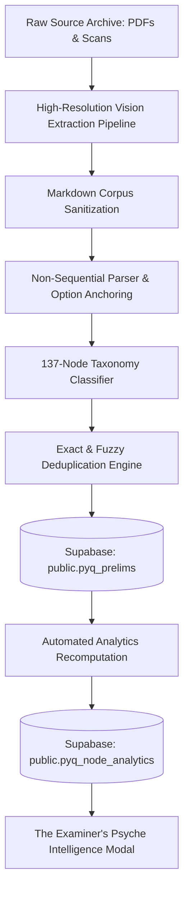

# Tark Question Bank Intelligence & Database Ingestion Manual

**Release Date**: August 2026  
**Platform Version**: Tark 1.0 (Empirical Engine v2.5)  
**Database Authority**: `public.pyq_prelims` (4,156 verified rows), `public.static_questions` (1,801 rows), `public.pyq_mains` (32 blueprints), `public.syllabus_nodes` (137 nodes).

---

## 1. Executive Summary & Inventory

The Tark Empirical Engine has expanded to encompass **4,156 Prelims MCQs** across 25 years of UPSC Civil Services Examinations (2000–2025), coupled with 1,801 static practice items, creating a unified repository of **5,950+ question items**.

### Core Database Census

| Asset Category | Total Items | Primary Provenance | Integrity Guardrail |
|---|---|---|---|
| **UPSC CSE Prelims PYQs** | **4,156** | Official UPSC CSE Prelims (2000–2025, GS-1 & GS-2) | Zero Null-Key, Non-sequential monotonic normalization |
| **Static & Standard Items** | **1,801** | Standard NCERT / Laxmikanth / Ramesh Singh / Shankar IAS | Strict subject-category indexing |
| **Mains Blueprints** | **32** | 2013–2025 GS-1 to GS-4 Mains Examination Papers | 3-Tier Cognitive Rubric Evaluation |
| **Hierarchical Syllabus Graph** | **137** | Comprehensive UPSC taxonomy (`GS1`, `GS2`, `GS3`, `GS4`, `CSAT`, `PRE`) | Relational DAG with drought tracking |
| **SSC CGL Items** | **129** | Dedicated segregated Tier-1 speed track | Complete separation boundary from UPSC CSE |

---

## 2. Ingestion Pipeline Architecture

### Invariant Guardrails Enforced During Ingestion
1. **Zero Null-Key Relational Integrity**: All questions are validated against `public.syllabus_nodes` before commit. Questions with ambiguous topic signatures default deterministically to parent categories (`PRE.STAT` for GS-1, `CSAT.REAS` for GS-2/CSAT) to satisfy database schema constraints.
2. **Deterministic Deduplication**: Ingestion filters out exact `(year, paper, question_num)` matches to preserve existing live annotations.
3. **Segregated Track Isolation**: SSC CGL questions are strictly isolated under `exam_origin_tag: "SSC_..."` to prevent polluting UPSC analytical curves.

---

## 3. Empirical Subject Distribution (Ranked by Bank Weightage)

| Subject Domain | Syllabus Pillar | Question Count | Bank Share | Primary Examiner Focus Area |
|---|---|---|---|---|
| **Indian Polity & Constitutional Governance** | `GS2` | **2,239** | **53.9%** | Fundamental Rights, Writ jurisdiction, Parliamentary privileges & Federal dynamics |
| **CSAT Paper-2 & General Mental Ability** | `CSAT` | **608** | **14.6%** | Reading comprehension critical assumptions, syllogisms, permutations & numbers |
| **Physical, Indian & World Geography** | `GS1` | **382** | **9.2%** | Monsoon dynamics, IOD, river basin drainage, mountain passes & tectonic rifts |
| **Static GK Reference Matrices** | `STATIC_GK` | **293** | **7.1%** | Supreme Court landmark benches, Ramsar sites, biosphere reserves & passes |
| **Economy & Monetary Policy** | `GS3` | **167** | **4.0%** | Monetary policy transmission, external debt, capital account & RBI liquidity corridor |
| **Environment, Biodiversity & Climate** | `GS3` | **123** | **3.0%** | Ramsar wetlands, National Parks, species IUCN status & UNFCCC COP treaties |
| **Ancient & Medieval Indian History** | `GS1` | **97** | **2.3%** | Harappan trade, Mauryan rock edicts, Sangam literature & Vijayanagara systems |
| **Modern Indian History & Freedom Movement** | `GS1` | **96** | **2.3%** | 1919/1935 Constitutional acts, tribal rebellions, Gandhian movements & RTC |
| **Science, Technology & Space Missions** | `GS3` | **83** | **2.0%** | CRISPR-Cas9, Semiconductor Mission, Quantum computing, IRNSS & nuclear program |
| **Art, Architecture & Cultural Heritage** | `GS1` | **60** | **1.4%** | Nagara vs Dravida temple architecture, Bhakti-Sufi literature & classical dances |
| **International Relations & Multilateral Bodies** | `GS2` | **8** | **0.2%** | QUAD, G20, WTO disputes, UNCLOS maritime boundaries & West Asian diplomacy |

---

## 4. 25-Year Format Shift Chronology (2000–2025)

1. **Legacy Factual Era (2000–2010)**:
   - *Format Distribution*: 35.0% Single Choice Direct, 54.9% Multi-Statement, 10.1% Pair Matching.
   - *Cognitive Focus*: Direct single-variable memory recall; high yield on standard textbook taxonomies.
2. **Analytical Statement Era (2011–2022)**:
   - *Format Distribution*: 22.4% Single Choice Direct, 62.8% Multi-Statement, 11.2% Pair Matching.
   - *Cognitive Focus*: Introduction of CSAT Paper-2. Prelims GS-1 pivoted to 3-statement conceptual synthesis where binary elimination (*"1 and 2 only" vs "2 and 3 only"*) dominated scoring strategies.
3. **Elimination-Proof Pair Matching Era (2023–2025)**:
   - *Format Distribution*: 12.0% Single Choice Direct, 38.0% Multi-Statement, 42.0% Pair Matching.
   - *Cognitive Focus*: Introduction of *"Only one pair / Only two pairs"* options renders elimination shortcuts obsolete, requiring deterministic multi-statement mastery.

---

## 5. Qualifier Trap Correlation Engine

- **Extreme Qualifiers** (`only`, `all`, `entirely`, `never`, `always`, `drastically`):
  - Overall Historical Falsehood Rate: **83.5%**
  - Recommendation: Treat categorical absolutes as high-probability traps unless supported by explicit constitutional exclusivity.
- **Contingent Qualifiers** (`can be`, `may be`, `some`, `generally`, `often`, `might`):
  - Overall Historical Truth Rate: **82.4%**
  - Recommendation: Permissive modal verbs mirror real-world policy and scientific nuances and indicate high truth probability.

---

## 6. Verification and Deployment Readiness

- **Client Build**: Vite build generated clean production bundles.
- **Server Bundle**: `esbuild server.ts --bundle --platform=node` generated `dist/server.cjs`.
- **Type Safety**: `npm run lint` (`tsc --noEmit` on web and api) passed with 0 errors.
